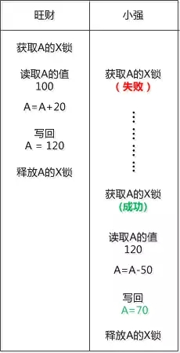
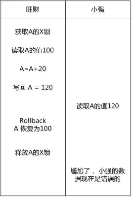
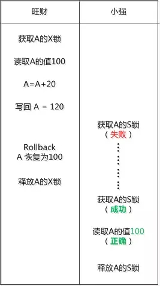
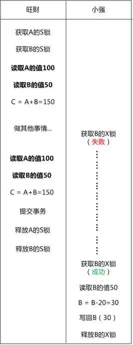
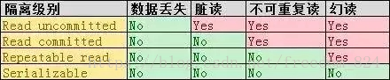

## 详解本地数据库事务的隔离级别

总结： bunnybunnycat

### 事务的隔离级别

为什么会出现隔离级别，本质原因：

- 并发多线程
- 多线程，进程访问相同的数据

我们接下来以一个从零开始的两位本地数据库村的两位小朋友的视角看事务的发展，看一看数据丢失，脏读，不可重复读，幻读四种问题是如何通过事务隔离级别来解决的。最后看看多版本控制(MVCC)是如何实现不加锁的。

#### Read uncommited

旺财是数据库村的一个程序， 小强R也是。

数据库村有个特点， 很多数据支持共享操作，多个程序可以同时读写，他们俩经常会为了读写同一个数据， 争夺的不可开交。

这一天，当旺财和小强对同一个银行账户A进行写操作时候， 出现了这么一个错误：

看看， 本来旺财要加上的20元就丢掉了。  

同样的事情发生的多了， 他俩给这种情况起了一个名字，叫“**丢失修改**”， 其实说白了就是俩人都去写一个数据， 一个人的数据把另外一个给覆盖了。

这是我们遇到的第一个错误：**丢失数据**。对应的隔离级别是**read uncommited**，小强读到旺财没有提交的数据，所以产生了这样的后果。

#### Read commited

村里的MySQL老头儿说： “你们两个小家伙，写数据的时候连加锁都不做，肯定会出大乱子！"

旺财说：“加什么锁？”

“来来来， 我教你们一个排他锁（Exclusive Lock） ,  简称**X锁**， 旺财你要写数据了， 就把它用X锁锁住， 锁住后，除非你释放， 否则小强无法获得X锁。 这不就解决你们的问题了？  ”

小强想了想， 就把上面的操作过程用X锁改了一下：

旺财说：“果然不错， 确实可以解决两个人同时修改导致的问题。"

小强说：“旺财， 我们约定，写数据的时候都用X锁吧？”

旺财说： “这没问题， 可是X锁只在写数据的时候用， 我们读数据是不用加锁的， 我想起了一种情况， 你看看怎么办？”

小强在旺财执行的途中读了A的值， 但是旺财把对A的修改给回滚(Rollback)了, 这下小强尴尬了， 他读到了**脏数据**。

“要不我们在读取数据的时候也加个X锁 ？ ” 小强说。

“那样太严格了， 就是读一个数据啊， 值得吗？”

“这样吧， 我们再搞一个新的锁出来， 专门用于共享数据的读取， 就叫共享锁(Share lock) ，简称S锁， 这个锁和之前的排他锁X锁有区别， 主要用于读取数据，  **如果一个数据加了X锁， 就没法加S锁， 同样加了S锁， 就没法加X锁**”  小强想出了一个点子。

“那如果我加了S锁， 你还能加S锁吗？ ”  旺财问。

“应该可以吧，  咱们俩都是读数据， 互不影响啊。 还有为了防止长时间的锁住， 我们可以约定一下，不管我们要做的事情有多少， **读一个数据之前加S锁， 读完之后立刻释放该S锁** ! ”

果然，这样一来“脏数据”的问题就解决了 ！

因为我们只能读到提交过的数据，所以不会读到**脏数据**了，这种隔离等级是**read commited**。

#### Repeated read

旺财和小强两个程序相安无事了很久， 但是S锁在读完数据后立刻释放的约定， 导致出了一个新问题。

旺财在一次数据处理中， 先读取了A和B的值， 相加得到了150 ，  然后小强把B改成了30

旺财再次读取A和B， 发现求和以后是130 , 刚才的不一样了！

旺财说： “小强，  我在读取数据的时候你不能改啊 ， 要不然我这里会出现不一致， 你看刚开始是A+B是 150， 现在变成130了”

小强说： “我们之前的约定是读数据时加S锁， 读完立马释放，  问题就出现在这里了。”

“看来在读数据的时候， 也需要一直锁定了， 直到事务提交。”

这样我们就可以**重复读**喽，因为读锁会在事务提交后释放。

#### Serializable

有一次旺财对一个“学生表”进行操作，选取了年龄是18岁的所有行， 用X锁锁住， 并且做了修改。

改完以后旺财再次选择所有年龄是18岁的行， 想做一个确认， 没想到有一行竟然没有修改！

这是怎么回事？  出了幻觉吗？

原来就在旺财查询并修改的的时候，  小强也对学生表进行操作， 他插入了一个新的行，其中的年龄也是18岁！  虽然两个人的修改都没有问题， 互不影响， 但从最终效果看， 还是出了事。

旺财说： “没辙了， 我们俩非得串行执行不可， 你必须得等我执行完。 ”

这就是数据库事务隔离级别的终极大招：**Serializable （串行化）**说白了就是顺序执行。也就不需要多线程并发了，当然一旦串行化，虽然保证了一致性，但是牺牲了全部的性能，这是不能允许的。

#### 总结一下

- 写数据时加上X锁，直到事务结束， 读的时候不加锁。虽然能够避免丢失数据，  但是可以读到没有提交或者回滚的内容 （脏数据）， 这其实就是数据库最低的事务隔离级别 --- **Read uncommitted**

- 写数据的时候加上X锁， 直到事务结束，  读的时候加上S锁， 读完数据立刻释放。这能避免“丢失数据”和“脏数据”，  但是会出现“不可重复读”的问题  ，  这是第二级的事务隔离级别 -- **Read committed**

-  写数据的时候加上X锁，  直到事务结束， 读数据的时候加S锁， 也是直到事务结束。这能避免“丢失数据”和“脏数据”， “不可重复读”三个问题 ， 这是数据库常用的隔离级别 --**Repeatable read**

#### MVCC多版本并发控制

说白了很简单，为每个事务生成递增的唯一的ID

每一行数据多了两个属性，一个是create version 和delete version

接下来我们以增删查改为例。

##### Insert

假设事务ID为1

| id   | name          | create version | delete version |
| ---- | ------------- | -------------- | -------------- |
| 1    | bunnybunnycat | 1              |                |

##### Delete

假设事务ID为3

| id   | name          | create version | delete version |
| ---- | ------------- | -------------- | -------------- |
| 1    | bunnybunnycat | 1              | 3              |

##### Update

假设事务ID为5

| id   | name          | create version | delete version |
| ---- | ------------- | -------------- | -------------- |
| 1    | bunnybunnycat | 1              | 5              |
| 1    | catcatbunny   | 5              |                |

##### Read

两条原则

- 删除版本在读事务之后，才可以读该行数据

- 创建版本在读事务之前，或者为同一个事务