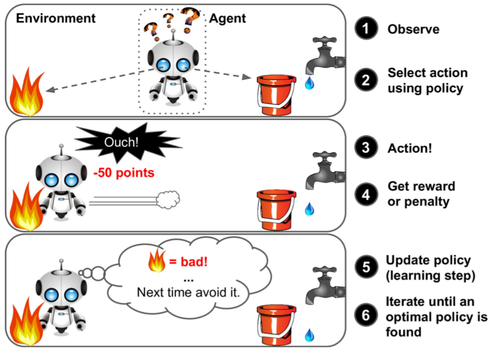
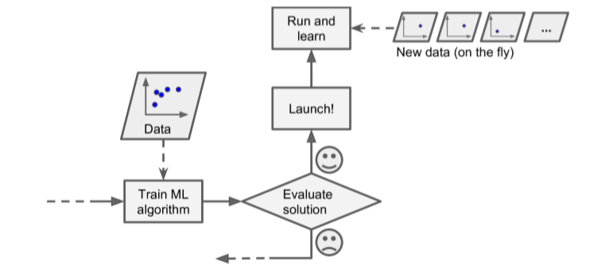
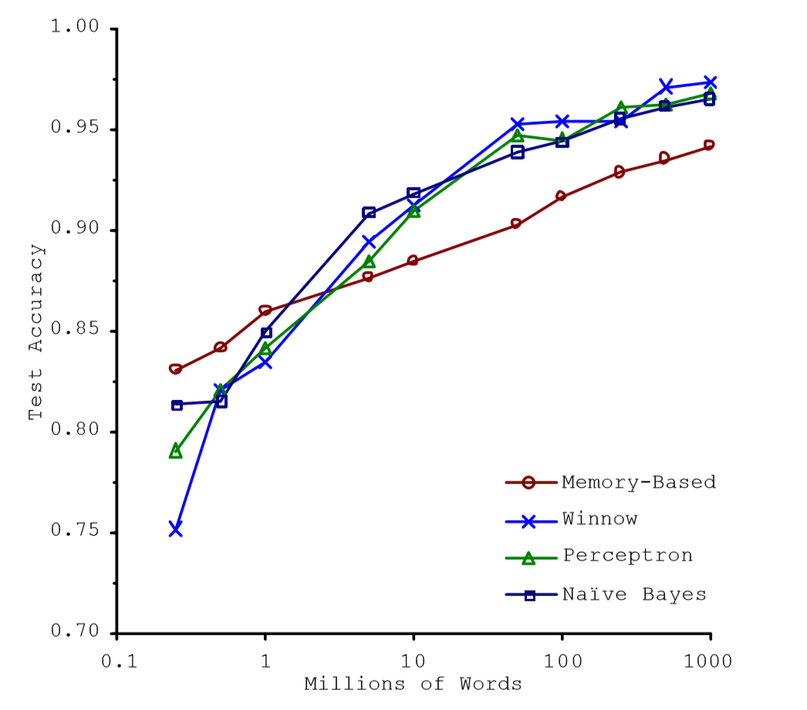

# Chapter1 机器学习概览

《Hands on machine learning with scikit-learn and tensorflow》读书笔记

整理：Howard Wonanut（不懂机器学习的菜鸟）

日期：2019-11-28

[TOC]

## 1.1 什么是机器学习？

定义1： 机器学习是通过编程让计算机从数据中进行学习的科学（和艺术）。

定义2：机器学习是让计算机具有学习的能力，无需进行明确的编程。

定义3：计算机程序利用经验E学习任务T，性能是P，如果针对任务T的性能P随着经验E不断增长，则称为机器学习。

## 1.2 机器学习的类型

机器学习有很多类型，可以根据不同的规则进行分类：

- 是否在人类监督下进行训练（监督、非监督、半监督和强化学习）
- 是否可以动态渐进学习（在线学习、批量学习）
- 是否只是通过简单地比较新的数据点和已知的数据点，或者在训练数据中进行模式识别，以建立一个新的预测模型（基于实例学习、基于模型学习）

### 1.2.1 监督/非监督学习

机器学习可以根据训练时监督的量和类型进行分类，主要有四类：监督学习、半监督学习、非监督学习和强化学习。

#### 1 监督学习

在监督学习中，用来训练算法的训练数据包含了答案（标签），监督学习可以细分为分类算法和回归算法，下面是一些重要的监督学习算法：

- k近邻算法
- 线性回归
- 逻辑回归
- 支持向量机
- 决策树和随机森林
- 神经网络

#### 2 非监督学习

非监督学习的训练数据是没有标签的，下面是一些重要的非监督学习算法：

- 聚类
  - k均值
  - 层次聚类分析
  - 期望最大值
- 可视化和降维：降维的目的是简化数据、但是不能失去大部分信息
  - 主成分分析
  - 核主成分分析
  - 局部线性嵌入（LLE）
  - t-分布邻域嵌入算法（t-SNE）
- 关联性规则学习
  - Apriori算法
  - Eclat算法

#### 3 半监督学习

半监督学习可以处理部分带标签的数据和大量不带标签的训练数据。

多数半监督学习算法是非监督和监督算法的结合，例如，深度信念网络是基于被称为互相叠加的受限玻尔兹曼机（RBM）的非监督组件。RBM是先用非监督方法进行训练，再用监督方法进行整个系统微调。

#### 4 强化学习

强化学习可以对环境进行观察，选择和执行动作，获得奖励（负奖励是惩罚），然后它必须自己学习哪个是最佳方法（学习策略，policy），以得到长久的最大奖励，如下图所示。

DeepMind的AlphaGo也是强化学习的应用。

### 1.2.2 批量学习/在线学习

另一个用来分类机器学习的准则是：它是否能够从导入的数据流进行持续的学习

#### 1 批量学习

在批量学习中，系统不能进行持续学习：必须用所有可用数据进行训练，这样的训练通常会占用大量的时间和计算资源，所以一般是线下进行的，训练好的模型再部署到生产环境中，之后便停止学习。因此它只是使用已经学习到的策略，这称为离线学习。

如果你想让一个批量学习系统认识一批新的数据，就需要从头训练一个新版本，使用全部的数据集（包括新的数据和老的数据），然后停掉旧系统，再换上新系统。

*如果你的系统需要自动学习，但是资源有限，周期性的进行批量学习是不切实际的，这也是批量学习的瓶颈*

#### 2 在线学习

在在线学习中，可以一次一个或者一次几个实例（称为小批量）进行训练。每次学习都很快而且成本较低，所以系统可以动态地学习到达的新数据，如下图所示：

在线学习适合不断接收连续流数据的应用场景，如股票预测系统，而且需要自动对改变做出调整。如果计算资源有限，在线学习是一个不错的方案。因为一旦在线学习系统学习了新的数据，它就不再需要这些数据了，所以可以扔掉这些数据，因此可以节省大量的空间，而且训练时间也短。

在线学习系统的一个重要参数是，它们可以多快地适应数据的改变：**学习速率**。如果学习速率太高，系统可以快速适应新数据，但是也会快速忘记老数据。相反的，学习速率太低，则系统学的慢，对新数据中地噪声或者没有代表性地数据点不太敏感。

在线学习地一个挑战是：如果脏数据被用来进行训练，系统的性能就会逐渐下滑。要降低这个风险，就需要不断检测系统性能，如果发现性能下降要尽快停止学习或者回滚到之前的状态；还可能需要对输入数据进行检测，发现反常数据。

### 1.2.3 基于实例/基于模型学习

另一种分类机器学习的方法是判断它们是如何进行归纳推广的。大多数机器学习任务是关于预测的，这意味着给定一定数量的训练样本，系统需要能够推广到之前没有见过的样本。对训练集有很好的性能还不够，真正的目标是对新实例预测的性能。

有两种主要的归纳方法：基于实例学习和基于模型学习

#### 基于实例学习

系统先用记忆学习案例，然后使用相似度测量推广到新的例子。

#### 基于模型学习

从训练样本中建立这些样本的模型，然后使用这个模型进行预测。

## 1.3 机器学习的主要挑战

机器学习的主要任务是选择一个学习算法并用一些数据进行训练，会导致错误的两件事就是“错误的算法”和“错误的数据”

### 1.3.1 训练数据量不足

需要大量的数据才能让多数机器学习算法正常工作。即便对于非常简单的问题，一般也需要数千的样本，对于复杂的问题，比如图像或者语音识别，可能需要数百万的样本。

> **数据不合理的有效性**
>
> 微软研究员Michele Banko和Eric Brill在2001年发表的著名论文《**Scaling to very very large corpora for natural language disambiguation**》中展示了不同的机器学习算法，包括非常简单的算法。他们的实验表明，一旦有了大量数据进行训练，各算法在去除语言歧义的测试中几乎有相同的性能。
>
> 
>
> 论文结果说明：也许我们可能需要重新考虑在算法开发vs语料库发展上花费时间和金钱的取舍。对于复杂问题，Norvig也在2009年发表的论文《The Unreasonable Effectiveness of Data 》则提出数据比算法更重要的主张。
>
> **但是由于中小型的数据集仍然是非常常见的，因此获得额外的训练数据并不总是轻易和廉价的，因此不要抛弃算法。**

### 1.3.2 没有代表性的训练数据

为了更好地进行归纳推广，让训练数据对新数据具有代表性是非常重要的，无论你使用的是基于实例学习或者是基于模型学习，这点都很重要。

如果使用了没有代表性的数据集，我们得到的模型不可能得到准确预测的模型。但是如何选择具有代表性的训练集是一个大问题：如果样本太小，就会有样本噪声（有一定概率包含没有代表性的数据）；如果取样方法错误的话，即使是非常大的样本也可能没有代表性。这叫做样本偏差。

### 1.3.3 低质量数据

很显然，如果训练集中的错误、异常值和噪声（错误测量引入的）太多，系统监测出潜在的难度就会变大，性能就会降低。花费时间对训练数据进行清理是十分重要的。事实上，大多数数据科学家的一大部分时间是在做数据清洗工作，例如：

- 如果一些实例是明显的异常值，最好删掉他们或者尝试手工修改错误；
- 如果一些实例缺少特征（比如5%的顾客没有说明年龄），必须决定是否忽略这个属性、忽略这些实例或者填入缺失值（平均值、中值等），或者训练一个含有这个特征的模型和一个不含有这个特征的模型，等等。

### 1.3.4 不相关的特征

俗话说得好：“Garbage in, garbage out”，只有你的训练数据在包含足够相关特征，并且非相关特征不多的情况下，模型才能进行学的好。机器学习项目成功的关键之一是用好嘚特征进行训练，这个过程称作特征工程，包括：

- 特征选择：在所有特征中选取最有用的特征进行训练
- 特征提取：组合存在的特征，生成一个更有用的特征（可以使用降维算法）
- 收集新数据创建特征

### 1.3.5 过拟合训练数据

**过拟合：模型在训练数据上表现很好，但是推广效果不好**

过于复杂的模型，如深度神经网络，可以检测数据中的细微规律，但是如果训练集有噪声，或者训练集太小（太小会引入样本噪声），模型就会去检测噪声本身的规律。很显然，这些规律不能推广到新实例。

过拟合发生在相对于训练数据量而言，模型过于复杂的情况，可能的解决方案有：

- 简化模型：选择一个参数更少的模型（比如使用线性模型替代高阶模型）、减少训练数据的属性数、限制模型等
- 收集更多的数据
- 减小训练数据的噪声（比如修改数据错误和去除异常值)

降低模型过拟合的方法有很多，正则化方法通过限制模型参数的复杂度、参数取值范围，来降低模型的复杂度。正则化的度可以用一个超参数控制。超参数是一个学习算法的参数，它是不会被学习算法本身影响到的，它在训练的过程中是保持不变的。

### 1.3.6 欠拟合训练数据

欠拟合和过拟合是相对的：当模型过于简单就有可能发生欠拟合，解决这个问题的方法：

- 选择一个更强大的模型，带有更多的参数
- 用更好的特征训练学习算法（特征工程）
- 减小对模型的限制（如减小正则化超参数）

## 1.4 测试和验证

只有通过测试才能知道一个模型的好坏。一般的，可以将数据分成两个集合：测试集和训练集。训练集的数据用于训练数据，测试集的数据用于测试模型性能。对新样本的错误率称作泛化错误（或样外本错误），通过模型对测试集的评估，你可以预估模型对新样本的性能。

> 一般使用80%的数据进行训练，使用剩下的20%进行测试。但是这取决于你的数据量的大小，如果你有10,000,000的数据，即使只取1%的数据用于测试，你的测试集也有100,000个实例了，这已经足够评估模型的性能了。

如果在训练集上的错误率低，在测试集上的错误率高则说明模型对训练数据存在过拟合。

### 1.4.1 超参调整和模型选择

现在假设线性模型的效果更好，但是你想做一些正则化以避免过拟合。问题是，如何选择正则化超参数的值？一种选项是用100个不同的超参数训练100个不同的模型。假设你发现模型使用最佳的超参数在测试集上的错误率最低，仅为5%。然后就选择这个模型在实际生产环境中应用，但是实际表现不佳，错误率达到了15%？为什么呢？

答案在于：**你犯了机器学习的大忌！你在测试集上多次测量了误差率，并且选择了最好的模型和超参数，这样选择的模型在训练集上效果的确达到了最好，但是测试集并不等于真正的应用场景中的数据！过拟合了！**

这个问题通常的解决方案是，再保留一个集合，称作验证集合。用训练集和多个超参数训练多个模型，在验证集上进行测试，选择最佳的模型和超参数。最后再在测试集上做最后一次测试（只用一次），以得到推广误差率的预估。

这个方法在大部分时候都没什么问题，然而，如果你的验证集太小，模型在验证集上的评估也会不准确，最终你选择的模型可能并不是最好的。相反的，如果验证集过大，那么训练集的样本量又会比较小，无法准确代表完整的训练集。通常解决的办法是使用交叉验证，训练集（不需要单独划分验证集了）分成互补的子集，每个模型用不同的子集训练，再用剩下的子集验证。一旦确定模型类型和超参数，最终的模型使用这些超参数和全部的训练集进行训练，用测试集得到推广误差率。

### 1.4.2 数据不匹配

在有些情况下，很容易获得大量的训练数据，但是需要弄清楚训练模型的数据是否和模型真正应用场景的数据匹配。

> 没有免费午餐定理
>
> 模型是对观察结果的简化，简化意味着需要舍弃无法进行推广的表面细节。但是，要确定舍弃什么数据、保留什么数据，必须要做假设。例如，线性模型的假设是数据基本上是线性的，实例和模型直线间的距离只是噪音，可以放心忽略。
>
> David Wolpert在1996年的一篇论文中证明：**如果完全不对数据做假设，就没有理由选择一个模型而不选另一个**。这称作没有免费午餐（NFL）公理。对于一些数据集，最佳模型是线性模型吗，而对其他数据集神经网络更好。没有一个模型可以保证效果更好。确信的唯一方法就是测试所有的模型，但这在实际引用中是不太可能的，就必须做一些对数据合理的假设，值评估几个合理的模型。例如，对于简单任务，你可能是用不同程度的正则化评估线性模型；对于复杂的问题，你可能需要平局几个神经网络模型。

（完结）