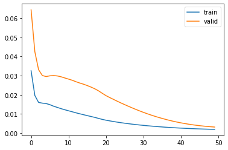
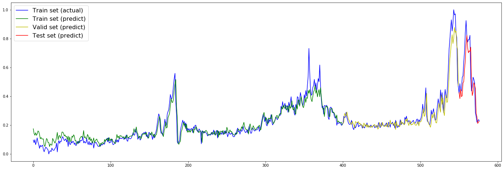

# 使用Keras LSTM预测时间序列

### 参考文章：

Kesci： Keras 实现 LSTM——时间序列预测：https://www.cnblogs.com/mtcnn/p/9411597.html


## 读取数据


```python
data_path = "/mnt/X500/farmers/tongyao/机器学习项目练习/industry_timeseries/"
```


```python
#查看其中一个地区的训练数据
import pandas as pd
import numpy as np
from keras.models import Sequential
from keras.layers import Dense, LSTM, Dropout, Flatten
import matplotlib.pyplot as plt
import glob, os
import seaborn as sns
import sys
from sklearn.preprocessing import MinMaxScaler
%matplotlib inline

columns = ['YEAR','MONTH','DAY','TEMP_HIG','TEMP_COL','AVG_TEMP','AVG_WET','DATA_COL']
data = pd.read_csv(data_path + 'timeseries_train_data/2.csv', names=columns)
data.head()
```

</style>
<table border="1" class="dataframe">
  <thead>
    <tr style="text-align: right;">
      <th></th>
      <th>YEAR</th>
      <th>MONTH</th>
      <th>DAY</th>
      <th>TEMP_HIG</th>
      <th>TEMP_COL</th>
      <th>AVG_TEMP</th>
      <th>AVG_WET</th>
      <th>DATA_COL</th>
    </tr>
  </thead>
  <tbody>
    <tr>
      <th>0</th>
      <td>2015</td>
      <td>2</td>
      <td>1</td>
      <td>1.9</td>
      <td>-0.4</td>
      <td>0.7875</td>
      <td>75.000</td>
      <td>160.477961</td>
    </tr>
    <tr>
      <th>1</th>
      <td>2015</td>
      <td>2</td>
      <td>2</td>
      <td>6.2</td>
      <td>-3.9</td>
      <td>1.7625</td>
      <td>77.250</td>
      <td>129.268657</td>
    </tr>
    <tr>
      <th>2</th>
      <td>2015</td>
      <td>2</td>
      <td>3</td>
      <td>7.8</td>
      <td>2.0</td>
      <td>4.2375</td>
      <td>72.750</td>
      <td>107.316539</td>
    </tr>
    <tr>
      <th>3</th>
      <td>2015</td>
      <td>2</td>
      <td>4</td>
      <td>8.5</td>
      <td>-1.2</td>
      <td>3.0375</td>
      <td>65.875</td>
      <td>132.549075</td>
    </tr>
    <tr>
      <th>4</th>
      <td>2015</td>
      <td>2</td>
      <td>5</td>
      <td>7.9</td>
      <td>-3.6</td>
      <td>1.8625</td>
      <td>55.375</td>
      <td>91.082841</td>
    </tr>
  </tbody>
</table>
</div>


## 数据预处理


```python
# 数据预处理：将序列数据转化为监督问题数据
from pandas import DataFrame
from pandas import concat

def series_to_supervised(data, n_in=1, n_out=1, dropnan=True):
    n_vars = 1 if type(data) is list else data.shape[1]
    df = DataFrame(data)
    cols, names = [], []
    # i: n_in, n_in-1, ..., 1
    # 代表t-n_in, ... ,t-1
    for i in range(n_in, 0, -1):
        cols.append(df.shift(i))
        names += [('var%d(t-%d)' % (j+1, i)) for j in range(n_vars)]
    for i in range(0, n_out):
        cols.append(df.shift(-i))
        if i == 0:
            names += [('var%d(t)' % (j+1)) for j in range(n_vars)]
        else:
            names += [('var%d(t+%d)' % (j+1, i)) for j in range(n_vars)]
    agg = concat(cols, axis=1)
    agg.columns = names
    if dropnan:
        agg.dropna(inplace=True)
    return agg
```


```python
# 将数据归一化到0-1之间,无量纲化
scaler = MinMaxScaler(feature_range=(0,1))
scaled_data = scaler.fit_transform(data[['DATA_COL','TEMP_HIG','TEMP_COL','AVG_TEMP','AVG_WET']].values)

# 将时序数据转换为监督问题数据
reframed = series_to_supervised(scaled_data, 1, 1)

#删除无用的label数据
reframed.drop(reframed.columns[[6,7,8,9]], axis=1, inplace=True)
print(reframed.info())
reframed.head()
```

运行结果

    <class 'pandas.core.frame.DataFrame'>
    Int64Index: 577 entries, 1 to 577
    Data columns (total 6 columns):
    var1(t-1)    577 non-null float64
    var2(t-1)    577 non-null float64
    var3(t-1)    577 non-null float64
    var4(t-1)    577 non-null float64
    var5(t-1)    577 non-null float64
    var1(t)      577 non-null float64
    dtypes: float64(6)
    memory usage: 31.6 KB
    None

<table border="1" class="dataframe">
  <thead>
    <tr style="text-align: right;">
      <th></th>
      <th>var1(t-1)</th>
      <th>var2(t-1)</th>
      <th>var3(t-1)</th>
      <th>var4(t-1)</th>
      <th>var5(t-1)</th>
      <th>var1(t)</th>
    </tr>
  </thead>
  <tbody>
    <tr>
      <th>1</th>
      <td>0.122335</td>
      <td>0.049869</td>
      <td>0.265823</td>
      <td>0.212693</td>
      <td>0.599165</td>
      <td>0.096338</td>
    </tr>
    <tr>
      <th>2</th>
      <td>0.096338</td>
      <td>0.162730</td>
      <td>0.177215</td>
      <td>0.236842</td>
      <td>0.636743</td>
      <td>0.078052</td>
    </tr>
    <tr>
      <th>3</th>
      <td>0.078052</td>
      <td>0.204724</td>
      <td>0.326582</td>
      <td>0.298142</td>
      <td>0.561587</td>
      <td>0.099070</td>
    </tr>
    <tr>
      <th>4</th>
      <td>0.099070</td>
      <td>0.223097</td>
      <td>0.245570</td>
      <td>0.268421</td>
      <td>0.446764</td>
      <td>0.064529</td>
    </tr>
    <tr>
      <th>5</th>
      <td>0.064529</td>
      <td>0.207349</td>
      <td>0.184810</td>
      <td>0.239319</td>
      <td>0.271399</td>
      <td>0.085949</td>
    </tr>
  </tbody>
</table>


## 数据划分


```python
# 数据集划分,选取前400天的数据作为训练集,中间150天作为验证集,其余的作为测试集
train_days = 400
valid_days = 150
values = reframed.values
train = values[:train_days, :]
valid = values[train_days:train_days+valid_days, :]
test = values[train_days+valid_days:, :]
train_X, train_y = train[:, :-1], train[:, -1]
valid_X, valid_y = valid[:, :-1], valid[:, -1]
test_X, test_y = test[:, :-1], test[:, -1]

# 将数据集重构为符合LSTM要求的数据格式,即 [样本，时间步，特征]
train_X = train_X.reshape((train_X.shape[0], 1, train_X.shape[1]))
valid_X = valid_X.reshape((valid_X.shape[0], 1, valid_X.shape[1]))
test_X = test_X.reshape((test_X.shape[0], 1, test_X.shape[1]))
print(train_X.shape, train_y.shape, valid_X.shape, valid_y.shape, test_X.shape, test_y.shape)
```

    (400, 1, 5) (400,) (150, 1, 5) (150,) (27, 1, 5) (27,)


## 训练模型

使用Keras的Sequential搭建模型

```python
model = Sequential()
model.add(LSTM(50, activation='relu',input_shape=(train_X.shape[1], train_X.shape[2]), return_sequences=True))
model.add(Flatten())
model.add(Dense(1, activation='linear'))
model.compile(loss='mean_squared_error', optimizer='adam') 
model.summary()

# fit network
hist = model.fit(train_X, train_y, epochs=50, batch_size=32, validation_data=(valid_X, valid_y), verbose=1, shuffle=False)

# plot history
plt.plot(hist.history['loss'], label='train')
plt.plot(hist.history['val_loss'], label='valid')
plt.legend()
plt.show()
```

输出结果

    _________________________________________________________________
    Layer (type)                 Output Shape              Param #   
    =================================================================
    lstm_21 (LSTM)               (None, 1, 50)             11200     
    _________________________________________________________________
    flatten_3 (Flatten)          (None, 50)                0         
    _________________________________________________________________
    dense_19 (Dense)             (None, 1)                 51        
    =================================================================
    Total params: 11,251
    Trainable params: 11,251
    Non-trainable params: 0
    _________________________________________________________________
    Train on 400 samples, validate on 150 samples
    Epoch 1/50
    400/400 [==============================] - 3s 6ms/step - loss: 0.0325 - val_loss: 0.0644
    Epoch 2/50
    400/400 [==============================] - 0s 152us/step - loss: 0.0196 - val_loss: 0.0425
    ...
    Epoch 50/50
    400/400 [==============================] - 0s 176us/step - loss: 0.0019 - val_loss: 0.0031





## 看看预测结果如何

```python
plt.figure(figsize=(24,8))
train_predict = model.predict(train_X)
valid_predict = model.predict(valid_X)
test_predict = model.predict(test_X)
plt.plot(values[:, -1], c='b', label="Train set (actual)")
plt.plot([x for x in train_predict], c='g', label="Train set (predict)")
plt.plot([None for _ in train_predict] + [x for x in valid_predict], c='y', label="Valid set (predict)")
plt.plot([None for _ in train_predict] + [None for _ in valid_predict] + [x for x in test_predict], c='r', label="Test set (predict)")
plt.legend(fontsize=16)
plt.show()
```





