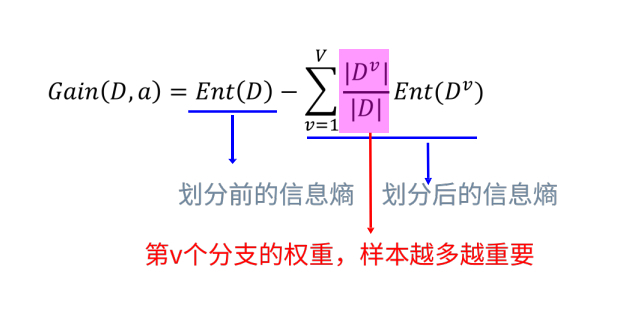
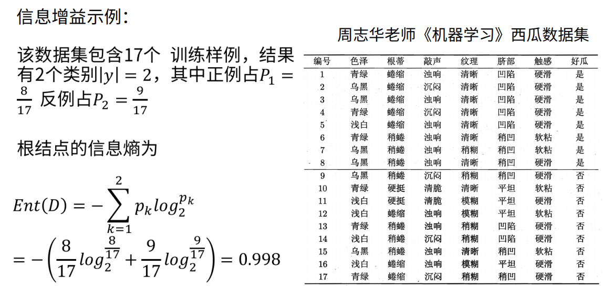
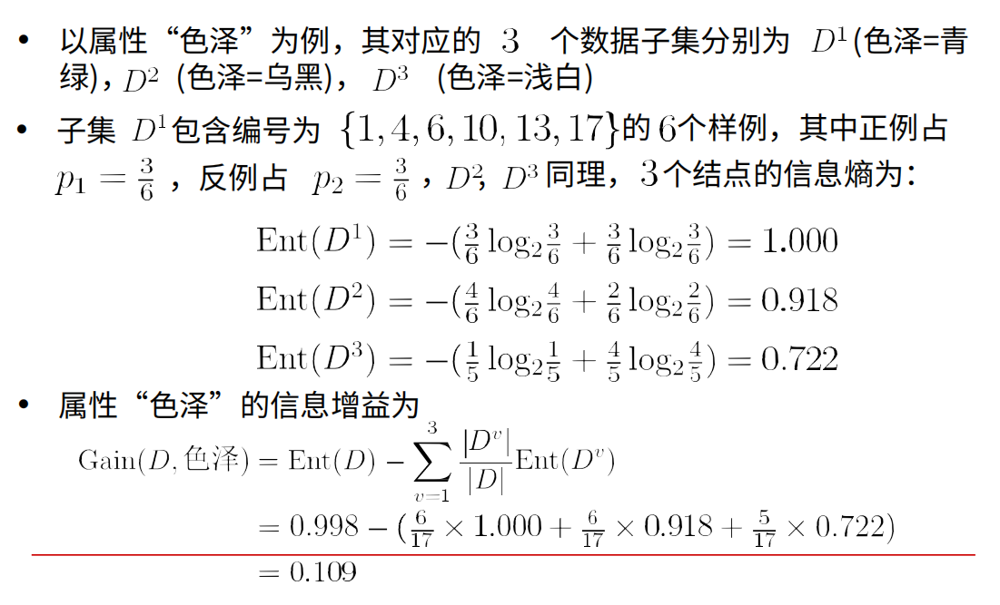
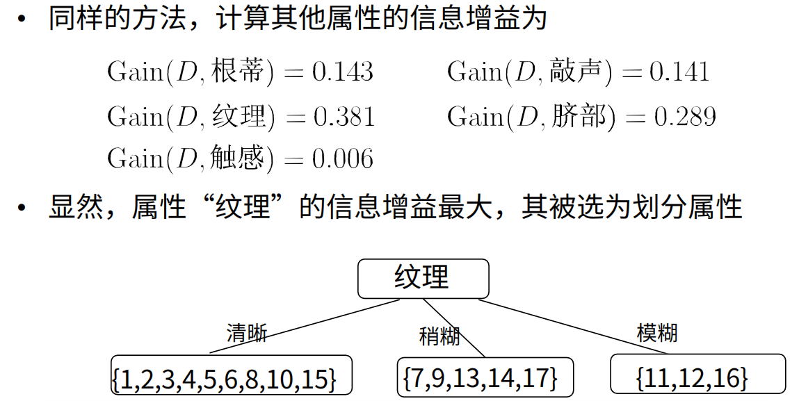
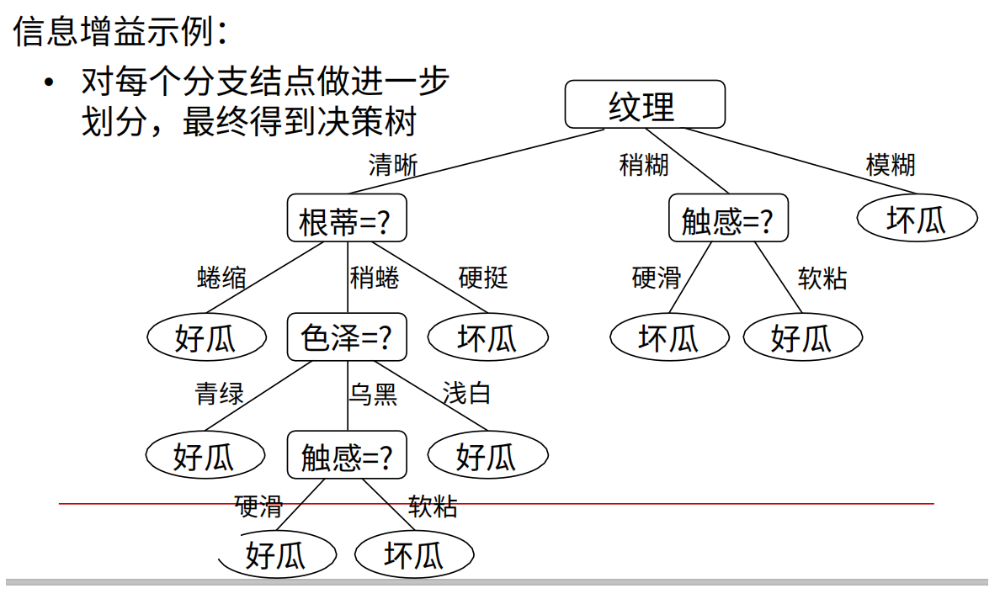

# 决策树

@Author: Howard Wonanut

@Date: 2019-12

决策树模型是一种分而治之的分类/回归算法，在分类问题中，表示基于特征对实例进行分类的过程。常用的决策树算法有ID3、C4.5和CART。

[TOC]

## 1 概览

### 1.1 决策树算法优缺点

**决策树算法的优点：**

- 模型具有可读性，易于理解
- 分类速度快，时间复杂度小
- 可以处理数字和类别特征
- 能够直接进行多分类
- 对缺失值不敏感
- 可以处理不相关特征数据

**决策树算法的缺点：**

- 对连续性的字段比较难预测
- 容易出现过拟合
- 当类别太多时，错误可能就会增加的比较快
- 在处理特征关联性比较强的数据时表现得不是太好
- 对于各类别样本数量不一致的数据，在决策树当中，信息增益的结果偏向于那些具有更多数值的特征

### 1.2 决策树生成过程

决策树生成过程主要包含3个步骤：特征选择、决策树生成和剪枝

- 特征选择：从训练数据众多的特征中选择一个特征作为当前节点的分裂标准，不同的决策树算法有不同的分裂标准（如使用信息增益的ID3，使用信息增益率的C4.5，使用基尼系数的CART）
- 决策树生成：根据选择的特征评估标准，从上至下递归地生成子节点，直到数据集不可分则决策树停止生长。
- 剪枝：决策树容易过拟合，一般来说需要剪枝，缩小树结构的规模从而缓解过拟合。剪枝分为预剪枝和后剪枝。

### 1.3 决策树算法基本框架

## 2 ID3算法

### 2.1 熵的定义

熵可以度量随机变量的不确定性，熵越大则样本的不确定性越大。例如，在决策树算法中熵越低表示该数据纯度越高（即可分）；熵越高表示该数据纯度越低（即不可分）。其定义为：

> 假设随机变量X的可能取值有$x_1,x_2,...,x_n$，对于每一个可能的取值$x_i$，其概率为$p_i$，则随机变量X的熵为：
> $$
> H(X)=-\sum_{i=1}^n{p_i\log_2{p_i}}
> $$

> 对样本集合，假设样本有k个类别，每个类别的概率为$\frac{|C_k|}{|D|}$，其中 ${|C_{k}|}$为类别为k的样本个数，$|D|$为样本总数，则样本集合D的熵为：
> $$
> H(D)=-\sum_{k=1}^{k}\frac{|C_{k}|}{|D|}log_{2}\frac{|C_{k}|}{|D|}
> $$

信息熵通俗来说就是用来度量包含的“信息量”，如果样本的属性都是一样的，就会让人觉得这包含的信息很单一，没有差异化，相反样本的属性都不一样，那么包含的信息量就很多了。

### 2.2 信息增益

在2.1中提到过，熵越大，样本的不确定性就越大，因此可以使用划分前后集合的熵的差值来衡量使用当前特征对于样本集D划分效果的好坏，这个差值就是**信息增益**。

> 假设划分前样本集合D的熵为$H(D)$，使用特征A划分数据集，划分后的数据子集的熵为$H(D|A)$，则信息增益$g(D,A)$为：
> $$
> g(D,A)=H(D)-H(D|A)
> $$

形象一点，用下图解释一下信息增益

### 2.3 ID3算法

ID3算法就是使用信息增益来**选择信息增益最大**的特征划分子节点，从而构建决策树。具体示例如下：

### 2.4 ID3算法的缺点

ID3算法使用信息增益来选择划分子节点的特征，会倾向于选择可取值数目较多的属性，例如考虑将“编号”作为一个特征，会优先选择“编号”划分数据，这并不是我们所希望的，因此引出了C4.5算法。

## 3 C4.5

### 3.1 信息增益比

为了解决信息增益的问题，引入了信息增益比，特征A对数据集D的信息增益比$gain\_ratio(D,A)$定义为其信息增益$g(D,A)$与数据集D关于特征A的值的熵之比：
$$
Gain\_ratio(D,A)=\frac{Gain(D,A)}{IV(A)}
$$

$$
IV(A)=-\sum_{v=1}^V{\frac{|D^v|}{|D|}\log_2{\frac{|D^v|}{|D|}}}
$$

其中V是特征A取值的个数。

特征A可能取值数目越多（即V越大），则$IV(A)$的值通常就越大。

### 3.2 C4.5算法

C4.5算法**选择信息增益比最大**的特征划分子节点，从而构建决策树。

### 3.2 C4.5算法的缺点

信息增益比倾向于选取取值较少的特征。

## 4 CART

## 5 决策树的剪枝

## 6 总结

决策树的生成，通常使用信息增益最大、信息增益比最大或者基尼指数最小作为特征选择的准则。决策树的生成往往通过计算信息增益或者其他指标，从根节点开始，递归地产生决策树。这相当于用信息增益或者其他准则不断地迭代选取局部最优特征，将训练集分割为能够基本正确分类的子集。