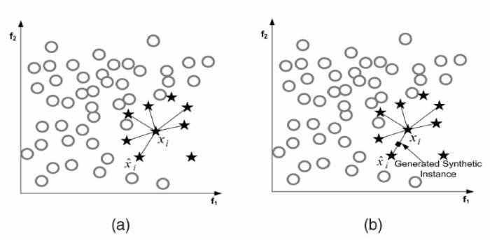
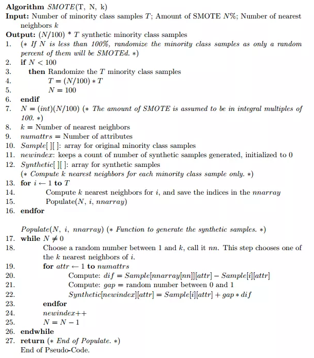
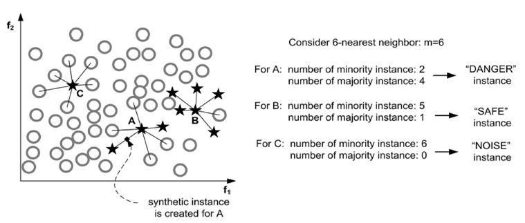

# 机器学习之数据不均衡问题篇（未完成）

[TOC]

在实际的机器学习问题中，往往各个类别的数据分布极其不均衡，例如医学数据中健康人的数据往往占据多数，仅有很少一部分患者数据。那么如果数据集中出现了数据不均衡问题，有哪些应对方法呢？本篇整理常见的处理方法如下。

- 上采样/下采样
- 加权
- 使用对不平衡数据不敏感的算法
- 使用对不平衡数据不敏感的评价指标：ROC/AUC
- 采用Bagging/Boosting/Ensemble等方法
- 考虑数据的先验分布

下面对其一一解释


## 0 生成不均衡数据集

`imblearn.datasets`和`sklearn.datasets`结合可以使得原本均衡的数据集变得不均衡，主要是通过ratio参数进行调节，以下代码来自[Imblearn package study](https://blog.csdn.net/kizgel/article/details/78553009)：

```python
from sklearn.datasets import load_iris
from imblearn.datasets import make_imbalance
iris = load_iris()
ratio = {0: 20, 1: 30, 2: 40}
X_imb, y_imb = make_imbalance(iris.data, iris.target, ratio=ratio)

sorted(Counter(y_imb).items())
Out[37]:
[(0, 20), (1, 30), (2, 40)]

#当类别不指定时, 所有的数据集均导入
ratio = {0: 10}
X_imb, y_imb = make_imbalance(iris.data, iris.target, ratio=ratio)

sorted(Counter(y_imb).items())
Out[38]:
[(0, 10), (1, 50), (2, 50)]

#同样亦可以传入自定义的比例函数
def ratio_multiplier(y):
    multiplier = {0: 0.5, 1: 0.7, 2: 0.95}
    target_stats = Counter(y)
    for key, value in target_stats.items():
        target_stats[key] = int(value * multiplier[key])
    return target_stats
X_imb, y_imb = make_imbalance(iris.data, iris.target,
                              ratio=ratio_multiplier)

sorted(Counter(y_imb).items())
Out[39]:
[(0, 25), (1, 35), (2, 47)]
```


## 1 上采样/下采样

采样的方法是通过采样的方法去掉一部分大类数据（欠采样）或者添加一部分小类数据（上采样），从而使得各个类别数据均衡的方法。上采样的常用策略有：随机过采样、SMOTE、ADASYM等。

### 1.1 随机上/下采样

最简单的处理样本不均衡的方法就是随机采样：从少数类的样本中进行随机采样来增加新的样本。`python`可以使用`imblearn`工具包完成随机采样，其包含随机上采样和随机下采样。

```python
from imblearn.over_sampling import RandomOverSampler, RandomUnderSampler

# 随机上采样
ros = RandomOverSampler(random_state=0)
X_resampled, y_resampled = ros.fit_sample(X, y)

# 随机下采样
rus = RandomUnderSampler(random_state=0)
X_resampled, y_resampled = rus.fit_sample(X, y)

# 执行以上代码能够使得每类样本数相同
```

虽然随机采样能够使得样本集变得均衡，但是也会带来一些问题，比如，过采样会多次复制少数类样本，因此会有很多重复样本，很容易造成过拟合；而欠采样会丢弃一部分样本，可能会损失部分有用信息，造成模型只学到了整体模式的一部分。

[1]: 《百面机器学习》	"百面机器学习"


### 1.2 生成新样本的过采样算法

生成新样本的过采样算法不再是简单的复制样本，而会生成一些新的样本。此类算法有SMOTE、ADASYN、Borderline-SMOTE等。

#### 1.2.1 SMOTE（Synthetic Minority Oversampling Technique）

SMOTE算法对少数类样本集$S_{min}$中的每个样本x，从它在$S_{min}$中的K近邻中随机选择一个样本y，然后在x，y的连线上随机选取一点作为新合成的样本，这种合成新样本的方法可以降低过拟合的风险。



其使用方法如下：

```python
from imblearn.over_sampling import SMOTE

X_resampled_smote, y_resampled_smote = SMOTE().fit_sample(X, y)
```


SMOTE算法伪代码：




#### 1.2.2 Borderline-SMOTE

由于SMOTE算法为每个少数类样本合成相同数量的新样本，这可能会增大类间重叠度，并且会生成一些不能提供有益信息的样本，为此出现了Borderline-SMOTE、ADASYN等改进算法。

Borderline-SMOTE只给那些处在分类边界上的少数类样本合成新样本。即为每个小众样本计算K近邻，只为那些K近邻中有一半以上大众样本的小众样本生成新样本。直观地讲，只为那些周围大部分是大众样本的小众样本生成新样本，因为这些样本往往是边界样本。确定了为哪些小众样本生成新样本后再利用SMOTE生成新样本。

假设a为少数类中的一个样本，此时少数类的样本分为三类，如下图所示：



- 噪音样本(noise)， 该少数类的所有最近邻样本都来自于不同于样本a的其他类别：

- 危险样本(in danger)， 至少一半的最近邻样本来自于同一类(不同于a的类别)；

- 安全样本(safe)， 所有的最近邻样本都来自于同一个类


对应的Python库中的实现有三种可以选择的规则，SMOTE函数中的kind参数控制了选择哪种规则：

- borderline1：最近邻中的随机样本与该少数类样本a来自于不同的类；

- borderline2：最近邻中的随机样本可以是属于任何一个类的样本；

- svm：使用支持向量机分类器产生支持向量然后再生成新的少数类样本。


borderline1，borderline2的python使用代码如下：

```python
from imblearn.over_sampling import BorderlineSMOTE 

# kind{“borderline-1”, “borderline-2”}, default=’borderline-1’
X_resampled_smote, y_resampled_smote = BorderlineSMOTE().fit_resample(X, y)
```


#### 1.2.2 ADASYN（Adaptive Synthetic）

关注的是在那些基于K最近邻分类器被错误分类的原始样本附近生成新的少数类样本。

使用方法：

```python
from imblearn.over_sampling import ADASYN
X_resampled, y_resampled = ADASYN().fit_resample(X, y)
```


### 1.3 生成新样本的下采样方法


### 1.4 过采样和下采样结合

在之前的SMOTE方法中，当由边界的样本与其他样本进行过采样差值时，很容易生成一些噪音数据。因此，在过采样之后需要对样本进行清洗。这样, 将过采样算法SMOTE和欠采样的TomekLink 与 EditedNearestNeighbours方法结合就能实现上述的要求：

- SMOTEENN

```python
from imblearn.combine import SMOTEENN
smote_enn = SMOTEENN(random_state=0)
X_resampled, y_resampled = smote_enn.fit_sample(X, y)
```


- SMOTETomek

```python
from imblearn.combine import SMOTETomek
smote_tomek = SMOTETomek(random_state=0)
X_resampled, y_resampled = smote_tomek.fit_sample(X, y)
```


### 1.5 Ensemble

一个不均衡的数据集能够通过多个均衡的子集来实现均衡, [`imblearn.ensemble`](http://contrib.scikit-learn.org/imbalanced-learn/stable/api.html#module-imblearn.ensemble)模块能实现上述功能.