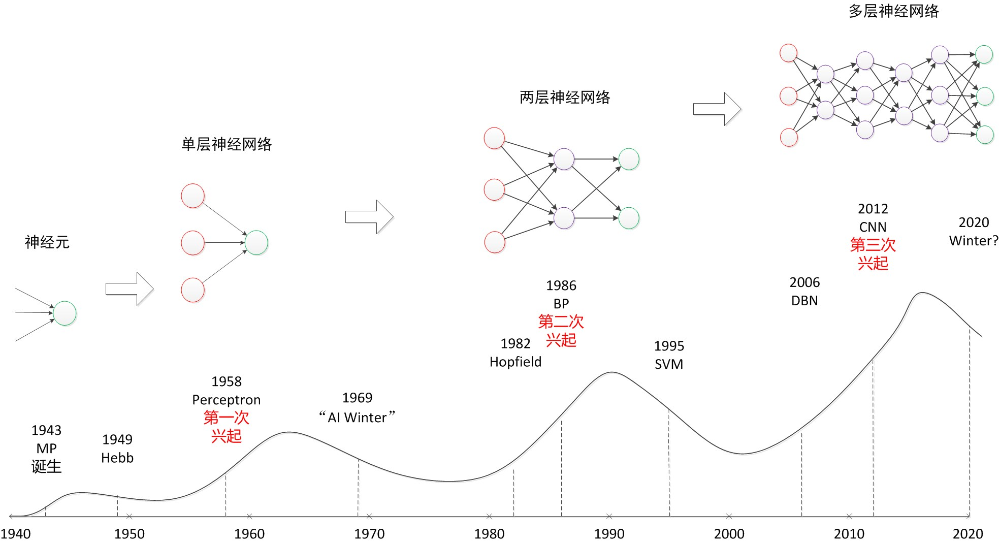
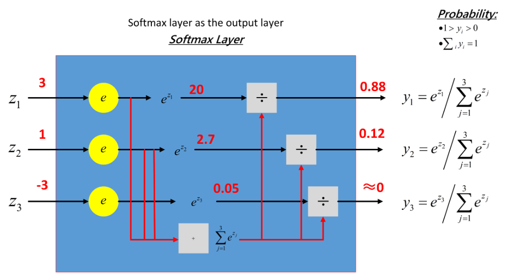
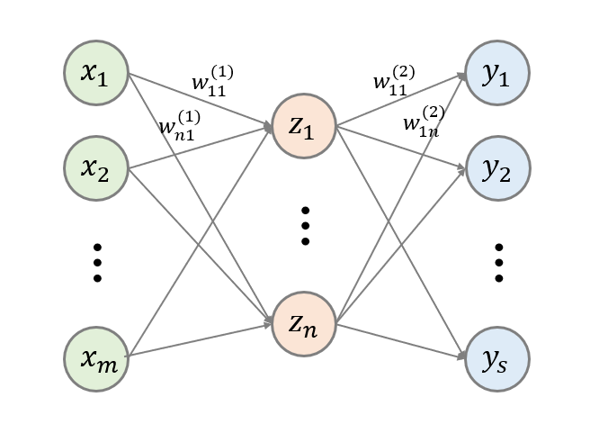

[TOC]

# 神经网络基础

> 参考资料
>
> 1. https://github.com/scutan90/DeepLearning-500-questions
> 2. 《图解深度学习》 山下隆义 著
> 3. http://deeplearning.net/tutorial/mlp.html
> 4. [https://github.com/NLP-LOVE/ML-NLP](https://github.com/NLP-LOVE/ML-NLP)

## 1 神经网络基础概述

### 1.1 神经网络发展历史

深度学习是基于神经网络技术发展起来的，而神经网络的发展可以大致分为三个阶段。

 

- 人们对于神经网络的研究可以追溯到20世纪40年代，并且第一次热潮持续到20世纪60年代末。1943年，美国神经生理学家沃伦 · 麦卡洛克和数学家沃尔特 · 皮茨对生物神经元进行建模，首次提出了一种形式神经元模型。这个模型通过电阻等原件构建的物理网络得以实现，被称为**M-P模型**。1958年，罗森布拉特又提出了**感知器**，这意味着经过训练后，计算机能够确定神经元的连接权重。不过在1969年，明斯基等人指出**感知器无法解决线性不可分问题**（比如异或问题），使得神经网络的研究陷入了低潮。

  > 异或运算这样的线性不可分问题可以通过多层感知器决定，但是当时人们还不清楚如何进行分层训练。

-  20世纪80年代鲁梅尔哈特等人提出了误差反向传播算法，通过设置多层感知器解决了线性不可分问题。同一时期，福岛等人提出了神经认知机，神经认知机模拟了生物的数据传到通路。*LeCun*（杨李昆，*Yann LeCun*）等人将相当于生物初级视觉皮层的卷积层引入到神经网络中，提出了卷积神经网络，使用误差反向传播网络算法虽然能够进行分层训练，但是仍然存在一些问题，比如训练时间过长，只能根据经验设定参数，没有预防过拟合的理论依据，再加上当时支持向量机等方法备受瞩目，神经网络的研究再次陷入低潮。

- 自2011年起，神经网络就在语音识别和图像识别基准测试中获得了压倒性的优势，自此迎来了它的第三次崛起。与第二次崛起时不同的是，在这个时期，**硬件已经得到了进一步的发展**，大量训练数据的搜集也更加容易。在硬件方面，提供过告诉的GPU并行运算，只需几天即可完成深层次的网络的训练。

### 1.2 深度学习有哪些应用

- 图像：图像识别、物体识别、图片美化、图片修复、目标检测。
- 自然语言处理：机器创作、个性化推荐、文本分类、翻译、自动纠错、情感分析。
- 数值预测、量化交易

### 1.3 神经网络的基本结构

神经网络的一般结构是由**输入层、隐藏层(神经元)、输出层**构成的。隐藏层可以是1层或者多层叠加，层与层之间是相互连接的，如下图所示。

**一般说到神经网络的层数是这样计算的，输入层不算，从隐藏层开始一直到输出层，一共有几层就代表着这是一个几层的神经网络**，例如上图就是一个三层结构的神经网络。

**解释隐藏层的含义：**在一个神经网络中，当你使用监督学习训练它的时候，训练集包含了输入𝑥也包含了目标输出𝑦，所以术语隐藏层的含义是在训练集中，这些中间结点的准确值我们是不知道到的，也就是说你看不见它们在训练集中应具有的值。

- 多隐藏层的神经网络比 单隐藏层的神经网络工程效果好很多。
- 提升隐层层数或者隐层神经元个数，神经网络“容量”会变大，空间表达力会变强。
- 过多的隐层和神经元节点，会带来过拟合问题。
- 不要试图通过降低神经网络参数量来减缓过拟合，用正则化或者dropout。

## 2 感知器&多层感知器

神经网络中每个结点都是一个个的感知器，下面我们从最基本的感知器开始介绍！

### 2.1 感知器

简单的感知机如下图所示：

其中$x_1$，$x_2$，$x_3$为感知机的输入，其输出为：
$$
output = \left\{
\begin{aligned}
0, \quad if \ \ \sum_i w_i x_i \leqslant threshold \\
1, \quad if \ \ \sum_i w_i x_i > threshold
\end{aligned}
\right.
$$
假如把感知机想象成一个加权投票机制，比如 3 位评委给一个歌手打分，打分分别为$ 4 $分、$1$ 分、$-3 $分，这$ 3$ 位评分的权重分别是 $1、3、2$，则该歌手最终得分为 $4 \times 1 + 1 \times 3 + (-3) \times 2 = 1$ 。按照比赛规则，选取的 $threshold$ 为 $3$，说明只有歌手的综合评分大于$ 3$ 时，才可顺利晋级。对照感知机，该选手被淘汰，因为：
$$
\sum_i w_i x_i < threshold=3, output = 0
$$
用 $-b$  代替 $threshold$，输出变为：
$$
output = \left\{
\begin{aligned}
0, \quad if \ \ \boldsymbol{w} \cdot \boldsymbol{x} + b \leqslant 0 \\
1, \quad if \ \ \boldsymbol{w} \cdot \boldsymbol{x} + b > 0
\end{aligned}
\right.
$$
设置合适的  $\boldsymbol{x}$  和  $b$ ，一个简单的感知机单元的与非门表示如下：

当输入为 $0$，$1$ 时，感知机输出为 $ 0 \times (-2) + 1 \times (-2) + 3 = 1$。

#### 2.1.1 感知机的权重学习过程

(下面是对单个感知机更新权重的过程)

感知机采用随机**梯度下降**算法更新权重，假设给定样本$(x,y)$，感知机的输出值为$\hat{y}$，则均方误差为
$$
E=\frac{1}{2}(y-\hat{y})^2
$$
使用梯度下降算法使得最终的均方误差能够尽可能的小，而负梯度方向就是误差下降最快的方向，对其求偏导
$$
\frac{\partial{E}}{\partial{w_i}}=\frac{\partial{E}}{\partial{\hat{y}}}\frac{\partial{\hat{y}}}{\partial{w_i}}=-(y-\hat{y})\frac{\partial{f(\sum_{i=1}^nw_ix_i)}}{\partial{w_i}}
$$
其中$f$为激活函数，在这里使用的是阶跃函数，因此有
$$
\frac{\partial{E}}{\partial{w_i}}=-(y-\hat{y})x_i
$$
令学习步长为$\eta,\eta\in(0,1)$，则
$$
\Delta{w_i}=-\eta\frac{\partial{E}}{\partial{w_i}}=\eta(y-\hat{y})x_i
$$

#### 2.1.2 单层感知机的局限性

异或门仅当x1或x2中的一方为1时，才会输出1。真值表如下：

| $x_1$ | $x_2 $ | $y$  |
| :---: | :----: | :--: |
|   0   |   0    |  0   |
|   0   |   1    |  1   |
|   1   |   0    |  1   |
|   1   |   1    |  0   |

使用坐标轴形象的表示一下异或问题，如下图所示无法使用一条直线将异或问题进行二分类。

只有使用下图这样的曲线才能够将其分类，因此异或问题是线性不可分的，使用单个的感知器是无法完成该分类任务的，这时就需要多层感知器出场了。

*线性不可分：无法用一条直线（超平直面）将两个类别区分开的就是线性不可分问题。

复杂一些的感知机由简单的感知机单元组合而成：

### 2.2 多层感知机

> 参考资料：
>
> http://deeplearning.net/tutorial/mlp.html
>
> https://blog.csdn.net/u012162613/article/details/43221829

多层感知机（MP，Multilayer Perceptron）也叫人工神经网络（ANN，Artificial Neural Network），除了输入层和输出层之外，它可以有多个隐藏层。最简单的MLP只有一个隐藏层，如下图所示：

多层感知机层与层之间是全连接的。从形式上看，单隐藏层的MLP是一个函数：
$$
f(x)=G(b^{(2)}+W^{(2)}(s(b^{(1)}+W^{(1)}x)))
$$
其中$b^{(i)}$是第$i$层（输入层不算）上的偏置量，$W^{(i)}$是第$i$层的连接权重$G$和$s$是激活函数。

上面的公式也就表示了神经网络中**信号前向传播**的过程，数据从输入层开始，乘以对应的权重并加上偏差之后，经过激活函数再作为下一层的输入，如此直至输出层。神经网络就是依靠这样一套机制来进行计算和预测的。 假如你的权值和偏置已经是被训练好了。对于一个新的输入，进行这样的过程，就能够得到一个预测。那么你就能够通过这个预测来解决一些问题了。所以有[机器学习](https://link.jianshu.com/?t=http://lib.csdn.net/base/machinelearning)思想的话，这些概念是很容易理解的。**而我们的任务就是通过训练找到合适的权值和偏置，使得网络预测输出结果能尽可能地准确。**

> 误差的修正学习是根据输入数据的期望输出和实际输出之间的误差来调整连接权重，但是不能跨层调整，所以在BP算法出现以前无法进行多层训练。
>
> 求解最佳的参数是一个最优化问题，**解决最优化问题最简单的就是梯度下降算法了**：首先随机初始化所有的参数（这个随机最好是满足某些规则，后面介绍梯度下降算法的时候会详细介绍的），然后使用反向传播算法更新参数，如此迭代直至达到最大迭代次数或者误差满足给定的阈值。这个过程涉及到正则化、代价函数、学习速率等问题。

### 2.3 多层感知机与逻辑回归

## 3 激活函数

### 3.1 激活函数的作用

1. 激活函数可以引入非线性因素。如果不使用激活函数，则输出信号仅是一个简单的线性函数，由于线性方程的复杂度有限，从数据中学习复杂函数的映射能力很小。如果没有激活函数，神经网络将无法学习和模拟其他复杂类型的数据，如图像、视频、音频、语音等等。

2. 激活函数可以把当前特征空间通过一定的线性映射转换到另一个空间，让数据能够更好的被分类。

   

一般的激活函数应该是**非线性**的，原因如下：

1. 线性的组合还是线性，如果网络中全都是线性组合，那么即使网络层数再深，其表示能力和两层的神经网络无差，因此也就无法逼近任意函数。
2. 使用非线性激活函数，可以使得网络更加强大，提升其学习复杂事务的能力。

一般用到的线性激活函数很少，在如下情况可以使用线性激活函数：

1. 输出层，大多数使用线性激活函数
2. 在隐层可能会使用一些线性激活函数

### 3.2 激活函数的性质

1. 非线性：如果激活函数是线性的，一个两层的神经网络就可以基本上逼近所有的函数。
2. 可微性：当优化方法是基于**梯度**的时候，就体现了该性质。
3. 单调性：当激活函数是单调的时候，单层网络能够保证是凸函数。
4. $ f(x)≈x $： 当激活函数满足这个性质的时候，如果参数的初始化是随机的较小值，那么神经网络的训练将会很高效；如果不满足这个性质，那么就需要详细地去设置初始值；
5. 输出值的范围： 当激活函数输出值是有限的时候，基于梯度的优化方法会更加稳定，因为特征的表示受有限权值的影响更显著；当激活函数的输出是无限的时候，模型的训练会更加高效，不过在这种情况小，一般需要更小的 Learning Rate。

### 3.3 常见的激活函数及其图像

1. **sigmoid 激活函数**

   函数的定义为：$ f(x) = \frac{1}{1 + e^{-x}} $，其值域为 $ (0,1) $。

   函数图像如下：

2. **tanh激活函数**

   函数的定义为：$ f(x) = tanh(x) = \frac{e^x - e^{-x}}{e^x + e^{-x}} $，值域为 $ (-1,1) $。

   函数图像如下：

3. **Relu激活函数**

   函数的定义为：$ f(x) = max(0, x) $  ，值域为 $ [0,+∞) $；

   ReLU激活函数的特点：

   - 在区间变动很大的情况下，ReLU激活函数的导数或者激活函数的斜率都会远大于0。通常ReLU激活函数神经网络通常会比sigmoid或者tanh激活函数学习的更快。
   - sigmoid和tanh的导数在正负饱和区的梯度都会接近于0，这会造成梯度弥散，而ReLU不会产生这个问题。

   函数图像如下：

​	根据图像可看出具有如下特点：

		- 单侧抑制；

-	相对宽阔的兴奋边界；

 - 稀疏激活性；

   

   ReLU 函数从图像上看，是一个分段线性函数，把所有的负值都变为 0，而正值不变，这样就成为单侧抑制。

   因为有了这单侧抑制，才使得神经网络中的神经元也具有了稀疏激活性。

   **稀疏激活性**：从信号方面来看，即神经元同时只对输入信号的少部分选择性响应，大量信号被刻意的屏蔽了，这样可以提高学习的精度，更好更快地提取稀疏特征。当 $ x<0 $ 时，ReLU 硬饱和，而当 $ x>0 $ 时，则不存在饱和问题。ReLU 能够在 $ x>0 $ 时保持梯度不衰减，从而缓解梯度消失问题。

   

4. **Leak Relu 激活函数** 

   函数定义为： $ f(x) =  \left\{
   \begin{aligned}
   ax, \quad x<0 \\
   x, \quad x>0
   \end{aligned}
   \right. $，值域为 $ (-∞,+∞) $。 

   图像如下（$ a = 0.5 $）：

5. **SoftPlus 激活函数**

   函数的定义为：$ f(x) = ln( 1 + e^x) $，值域为 $ (0,+∞) $。

   函数图像如下:

6. **softmax 函数**

   函数定义为： $ \sigma(z_j) = \frac{e^{z_j}}{\sum_{k=1}^K e^{z_k}} $。

   Softmax 多用于多分类神经网络输出，关于softmax函数的详细介绍见 3.6.

### 3.4 常见的激活函数导数计算

对常见激活函数，导数计算如下：

| 原函数          | 函数表达式                                   | 导数                                                         | 备注                                                         |
| --------------- | -------------------------------------------- | ------------------------------------------------------------ | ------------------------------------------------------------ |
| Sigmoid激活函数 | $f(x)=\frac{1}{1+e^{-x}}$                    | $f^{'}(x)=f(x)(1-f(x))$                                      | 当$x=10$,或$x=-10$，$f^{'}(x) \approx0$,当$x=0$$f^{'}(x) =0.25$ |
| Tanh激活函数    | $f(x)=tanh(x)=\frac{e^x-e^{-x}}{e^x+e^{-x}}$ | $f^{'}(x)=-(tanh(x))^2$                                      | 当$x=10$,或$x=-10$，$f^{'}(x) \approx0$,当$x=0$$f^{`}(x) =1$ |
| Relu激活函数    | $f(x)=max(0,x)$                              | $c(u)=\begin{cases} 0,x<0 \\ 1,x>0 \\ undefined,x=0\end{cases}$ | 通常$x=0$时，给定其导数为1或0                                |

### 3.5 激活函数的选择

选择一个合适的激活函数没有定法，一般的如果不确定哪个激活函数更适合，可以把它们都试试，然后在验证集或者测试集上进行评价选择。

常见的选择情况总结如下：

1. 如果是二分类问题，输出为0或1：则输出层选择sigmoid函数，然后其他的所有单元都选择ReLU函数。
2. 如果在隐层上不确定使用哪个激活函数，通常选择ReLU，有时也会使用tanh激活函数。但是ReLU的一个优点是：当结果为负时，导数等于0。
3. sigmoid激活函数：除了输出层是一个二分类问题基本不会使用它。
4. tanh激活函数：tanh是非常优秀的，几乎适合所有场合。
5. ReLU：最常用的激活函数，如果不确定用哪个激活函数，就选择ReLu或者Leaky Relu。
6. Leaky ReLU：如果遇到了一些死的神经元，使用它。

### 3.6 Softmax函数介绍

Softmax 用于多分类过程中，它将多个神经元的输出，映射到 $ (0,1) $ 区间内，可以看成概率来理解，从而跟根据概率大小确定进行多分类问题的预测类别标签。假设我们有一个数组，$ V_i $ 表示 $ V $  中的第 $ i $ 个元素，那么这个元素的 softmax 值就是
$$
S_i = \frac{e^{V_i}}{\sum_j e^{V_j}}
$$
下图形象的解释了softmax的工作过程：

那么为什么要使用指数函数$e^x$呢？参考 logistic 函数：
$$
P(i) = \frac{1}{1+exp(-\theta_i^T x)}
$$
这个函数的作用就是使得 $ P(i) $ 在负无穷到 0 的区间趋向于 0， 在 0 到正无穷的区间趋向 1。同样地， **softmax 函数加入了 $ e $ 的幂函数正是为了两极化**：正样本的结果将趋近于 1，而负样本的结果趋近于 0。这样为多类别提供了方便（可以把 $ P(i) $ 看做是样本属于类别的概率）。可以说，Softmax 函数是 logistic 函数的一种泛化。

## 4 反向传播网络

> 《图解深度学习》 山下隆义 著

主要特点：**信号是前向传播的，误差是反向传播的**

### 4.1 为什么要使用反向传播网络

前面已经提到，由于连接的权重不能跨层调整，因此多层感知机存在一个很大的问题：如何调整多层网络之间的权值？这也就是为什么要使用反向传播网络的原因。误差反向传播算法就是通过比较实际输出和期望输出得到误差信号，把误差信号从输出层逐层向前传播得到各层的误差信号，再通过调整各层的连接权重以减少误差。权重的调整主要使用梯度下降法。

### 4.2 权重更新过程推导

以三层的多层感知机为例推导公式，以下图为示范

网络有两层：一个输入层、一个隐藏层和一个输出层，其中输入层中共有m个结点，隐藏层有n个结点，输出层有n个结点，分别用$i,j,k$代表这三层中的结点，在推导公式的过程中使用$sigmoid$激活函数作为示范。权重定义为$w^{(l)}_ij$，其中$l$代表当前权重层数（输入层不算，因此输入层-隐藏层之间的权重上标为1，隐藏层-输出层之间的权重上标为2），$i$和$j$分别代表权重的**终点与起点**（这里要注意了！之所以反着写是为了后面使用矩阵表示的时候方便），定义损失函数$E$为均方和误差函数：
$$
E_k=\frac{1}{2}(y_k-o_k)^2
$$
其中$y_k$指的是模型的实际输出，$o_k$指的是期望输出。在前面已经提过，$sigmoid$函数的导数为：
$$
f'(u)=f(u)(1-f(u))
$$
下面步入正题，开始推导！

**1 中间层与输出层之间的连接权重的更新**
$$
\frac{\partial{E_k}}{\partial{w^{(2)}_{kj}}}=\frac{\partial{E_k}}{\partial{y_k}}\frac{\partial{y_k}}{\partial{u^{(2)}_k}}\frac{\partial{u^{(2)}_k}}{\partial{w^{(2)}_{kj}}}
$$
这里的$u^2_k$表示的是输出层第$k$个结点的线性累加和，即有
$$
u^{(2)}_k=\sum_{j=1}^nz_jw^{(2)}_{kj}+b^{(2)}, \space y_k=f(u^{(2)}_k)
$$
其中的$f$代表激活函数，$b^{(2)}$代表第2层的偏置量。对式(11)计算可得
$$
\frac{\partial{E_k}}{\partial{w^{(2)}_{kj}}}=(y_k-o_k)y_k(1-y_k)z_j
$$
因此隐藏层-输出层之间的权重按照上面公式(9)即可完成更新，权重调整值记为$\Delta{w}$，权重调整过程为
$$
w_{kj}^{(2)} = w_{kj}^{(2)} - \eta(y_k-o_k)y_k(1-y_k)z_j
$$
$\eta$为学习率，亦称学习步长。

**2 输入层与中间层之间的连接权重的更新**
$$
\frac{\partial{E}}{\partial{w^{(1)}_{ji}}}=\sum_{k=1}^s[\frac{\partial{E_k}}{\partial{y_k}}\frac{\partial{y_k}}{\partial{u^{(2)}_k}}\frac{\partial{u^{(2)}_k}}{\partial{w^{(1)}_{ji}}}]
$$
因为
$$
\frac{\partial{u^{(2)}_k}}{\partial{w^{(1)}_{ji}}}=\frac{\partial{u^{(2)}_k}}{\partial{z_j}}\frac{\partial{z_j}}{\partial{u^{(1)}_j}}\frac{\partial{u^{(1)}_j}}{\partial{w^{(1)}_{ji}}}
$$
因此式(15)可以写为
$$
\frac{\partial{E}}{\partial{w^{(1)}_{ji}}}=\sum_{k=1}^s\{\frac{\partial{E_k}}{\partial{y_k}}\frac{\partial{y_k}}{\partial{u^{(2)}_k}}[\frac{\partial{u^{(2)}_k}}{\partial{z_j}}\frac{\partial{z_j}}{\partial{u^{(1)}_j}}\frac{\partial{u^{(1)}_j}}{\partial{w^{(1)}_{ji}}}]\}=\sum_{k=1}^s[(y_k-o_k)y_k(1-y_k)w^{(2)}_{kj}z_j(1-z_j)x_i]
$$
于是乎就得到了输入层与中间层的权重更新公式：
$$
w_{ji}^{(1)} = w_{ji}^{(1)} - \eta\sum_{k=1}^s[(y_k-o_k)y_k(1-y_k)w^{(2)}_{kj}z_j(1-z_j)x_i]
$$
至此，BP神经网络的权重更新过程就推导完毕了，怎么样也没想象中的难吧~

## 5 常见问题总结

### 5.1 为什么在信号前向传播的过程中需要加上偏置量？

I think that biases are almost always helpful. In effect, a bias value allows you to shift the activation function to the left or right, which may be critical for successful learning.

It might help to look at a simple example. Consider this 1-input, 1-output network that has no bias:

The output of the network is computed by multiplying the input (x) by the weight (w0) and passing the result through some kind of activation function (e.g. a sigmoid function.)

Here is the function that this network computes, for various values of w0:

Changing the weight w0essentially changes the "steepness" of the sigmoid. That's useful, but what if you wanted the network to output 0 when x is 2? Just changing the steepness of the sigmoid won't really work --you want to be able to shift the entire curve to the right.

That's exactly what the bias allows you to do. If we add a bias to that network, like so:

...then the output of the network becomes sig(w0*x + w1*1.0). Here is what the output of the network looks like for various values of w1:

Having a weight of -5 for w1shifts the curve to the right, which allows us to have a network that outputs 0 when x is 2.

### 5.2 神经网络在训练的过程中需要调整偏置量吗？

需要，偏置量和权重采用类似的更新方式。详细的更新过程见4.2

### 5.3 多层感知机是如何更新权值的？

在反向传播算法出现之前，多层感知机的权重更新一直限制了其发展。对于只有一层隐藏层的多层感知机而言，其权值的更新过程和单个感知机的更新过程一样：
$$
w_i=w_i+\alpha(r-y)x_i
$$

$$
h=h-\alpha(r-y)
$$

不过对于有多个隐藏层的感知机而言，如果不使用反向传播的思路更新权值，无法跨层调整连接权重。因此初期的多层感知器使用随机数确定输入层与中间隐藏层之间的连接权重，只对最后一层的隐藏层与输出层之间的连接权重进行误差修正学习。可想而知，这样的训练效果不会怎么好，也就是因为这样，才体现出了反向传播网络的厉害之处。(来自《图解深度学习》)

另外，如今`sklearn`中的`MLPClassifier`就是使用的BP思想训练网络的。 

### 5.4 为什么神经网络具有非线性切分能力？

> [https://github.com/NLP-LOVE/ML-NLP](https://github.com/NLP-LOVE/ML-NLP)

假设对下图进行分类，圆圈为一类，红叉叉为另一类，如果用线性切分的话无论如何都不能把它们进行分开。

这时，引入神经网络(2层神经网络)，包含一个隐藏层，在隐藏层中,分别得到了P1和P2的图形，P1这条线以上的部分都是红叉叉，P2这条线以下的部分都是红叉叉，两个神经元就有2条线性直线。从隐藏层到输出层要做的事情就是把这两条直线给合并起来，就会得到h(x)的图形，也就是说P1以上的空间交上P2以下的空间就是红叉叉的分类，其余空间分类为圆圈。这就使得原本不能够线性切分变成非线性切分了。

如果隐藏层更加复杂的话，就能够完美的实现复杂平面样本点分布的划分(类似于抠图)。