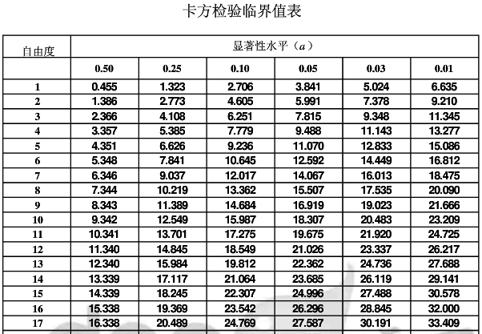

# 假设检验

[TOC]

假设检验也叫显著性检验，是以小概率反证法的逻辑推理，判断假设是否成立的统计方法，它首先假设样本对应的总体参数（或分布）与某个已知总体参数（或分布）相同，然后根据统计量的分布规律来分析样本数据，利用样本信息判断是否支持这种假设，并对检验假设做出取舍抉择，做出的结论是概率性的，不是绝对的肯定或者否定。


假设检验有两种错误，第一类型错误和第二类型错误。第一类型错误，是零假设成立的情况下拒绝零假设。第二类型错误，是备选假设成立的情况下接受零假设。

**假设检验保证，第一类型错误概率不超过α**。这是因为在零假设成立的情况下，统计量 st 值落在区域 I 的可能性小于等于α。对于第二类错误，假设检验就没有什么控制了。为什么假设检验控制第一类错误，而忽略第二类错误呢？一般情况下，零假设代表无效、无作用或者无影响，而备选假设代表有效、有作用或者有影响。这时候第一类错误的危害比第二类错误的大。比如在验证新算法有效性实验中，新算法实际无效但被认为有效的第一类型错误，会让大家错误地使用这个算法。新算法有效而被认为无效的第二类错误，只是让自己发不出论文，对大众没有影响。


## 1 假设检验的步骤

1. 建立检验假设和确定检验水准
2. 选定检验方法和计算检验统计量
3. 确定P值和做出推断结论


### 1.1 建立检验假设和确定检验水准

#### 1.1.1 建立检验假设

在均数的比较中，检验假设是针对总体特征而言，包括相互对立的两个方面：

- 原假设、零假设$H_0$：它是要否定的假设
- 备择假设$H_1$：它是$H_0$的对立面

二者是从反证法的思想提出的，$H_0$和$H_1$是相互联系又相互对立的假设。

研究者可能有两种目的：

1. 推断两个总体均数有无明显差别。不管是病人高于正常人还是低于正常人，两种可能性都存在，研究者同等关心，则应使用双侧检验。

2. 根据专业知识，已知病人不会低于正常人，或是研究者只关心病人是否高于正常人，应当使用单侧检验。

   > 双侧检验和单侧检验
   >
   > 在进行t检验时，如果其目的在于检验两个总体均数是否相等，即为双侧检验。例如检验某种新降压药与常用降压药效力是否相同？则新药效果可能比旧药、持平或者比旧药差，都有可能。
   >
   > 如果我们已知新药的药效不可能低于旧药，这时备择假设为$H_1:\mu_1>\mu_2$，称为单侧检验。

   

   **A: 样本均数（其总体均数为$\mu $）与已知的总体均数$\mu_0$做比较**

   |          | 目的                    | 原假设        | 备择假设        |
   | -------- | ----------------------- | ------------- | --------------- |
   | 双侧检验 | 检验是否$\mu \ne \mu_0$ | $\mu = \mu_0$ | $\mu \ne \mu_0$ |
   | 单侧检验 | 检验是否$\mu >\mu_0$    | $\mu =\mu_0$  | $\mu >\mu_0$    |
   |          | 检验是否$\mu < \mu_0$   | $\mu =\mu_0$  | $\mu <\mu_0$    |

   **B: 两样本均数比较（其总体均数分别为$\mu_1 $与$\mu_2$）**

   |          | 目的                      | 原假设          | 备择假设          |
   | -------- | ------------------------- | --------------- | ----------------- |
   | 双侧检验 | 检验是否$\mu_1 \ne \mu_2$ | $\mu_1 = \mu_2$ | $\mu_1 \ne \mu_2$ |
   | 单侧检验 | 检验是否$\mu_1 >\mu_2$    | $\mu_1 =\mu_2$  | $\mu_1 >\mu_2$    |
   |          | 检验是否$\mu_1 < \mu_2$   | $\mu_1 =\mu_2$  | $\mu_1 <\mu_2$    |


#### 1.1.2 检验水准

建设检验还需根据不同研究目的事先设置是否拒绝原假设的判断标准，即检验水准。检验水准也称为显著性水准，它指无效假设$H_0$为真，但被错误地拒绝的一个小概率值，一般取$\alpha=0.05$.

原假设、备择假设和显著性水准的确定，以及单侧检验或双侧检验的选择，都应该结合研究设计，在未获得样本结果之前决定，而不受样本结果的影响。


### 1.2 选定检验方法和计算检验统计量

要根据研究设计的类型和统计推断的目的选用不同的检验方法。如成组设计的两样本均数的比较用t检验，多个样本均数的比较用F检验。

检验统计量时用于抉择是否拒绝原假设的统计量，其统计分布在统计推断中是至关重要的，不同的检验方法要用不同的方式计算现有样本的检验统计量值。


### 1.3 确定P值和做出推断结论

P值是指由原假设成立时的检验统计量出现在由样本计算出来的检验统计量的末端或更末端处的概率值。

**当$P\le \alpha$时，结论为按所取检验水准拒原假设，接受备择假设**。这样做出结论的理由是：在原假设成立的条件下，出现等于及大于现有检验统计量值的概率小于$\alpha$（也即发生一类错误的概率），是小概率事件，这在一次抽样中是不大可能发生的，现有样本信息不支持原假设，因此拒绝他。

**如果$P>\alpha$，即样本信息支持原假设，就没有理由拒绝它，因此只好接受原假设。**

假设检验的结论是具有概率性的，不管是拒绝还是接受原假设，都有可能发生错误。拒绝原假设不等于原假设肯定不成立，因为小概率事件仍有可能发生只是可能性很小而已；同理，不拒绝原假设也不等于原假设肯定成立。


## 2 均值的比较：t检验

t检验也称学生t检验，**T检验是用于两个样本（或样本与群体）平均值差异程度**的检验方法。它是用T分布理论来推断差异发生的概率，从而判定两个平均数的差异是否显著。

**T检验的适用条件为样本分布符合正态分布**。

t检验的应用条件：

- 当样本数较小时，要求**样本取自正态总体**
- 做两样本均数比较时，要求两样本的总体方差相同（如果方差不同也可进行t检验）

> 使用Python进行t检验教程：https://blog.csdn.net/m0_37777649/article/details/74938120


### 2.1 t检验类型

t检验有多种类型，可以分为只有一组样本的单体检验和有两组样本的双体检验。单体检验用于检验样本的分布期望是否等于某个值。双体检验用于检验两组样本的分布期望是否相等，又分为配对双体检验和非配对双体检验。配对双体检验的两组样本数据是一一对应的，而非配对双体检验的两组数据则是独立的。比如药物实验中，配对双体检验适用于观察同一组人服用药物之前和之后，非配对双体检验适用于一组服用药物而一组不服用药物。


#### 2.1.1 单体检验

单体检验是针对一组样本的假设检验。零假设为$H_0: μ=μ0$。统计量服从自由度为n-1的 T 分布:
$$
t=\frac{\bar{x}-\mu_0}{s/\sqrt{n}}
$$
其中$\bar{x}$为样本均值，$s$为样本标准差，$n$为样本数。


#### 2.1.2 配对双体检验

配对样本应用场景：同一个样本在两个时间点的检测数据、同一个样本用两种检测方式的检测数据。

**前提：两组独立样本必须都符合正态分布！！**

配对双体检验针对配对的两组样本。配对双体检验假设两组样本之间的差值服从正态分布。如果该正态分布的期望为零，则说明这两组样本不存在显著差异。零假设为$H_0: μ=μ0$，统计量服从n-1的T分布:
$$
t=\frac{d-\mu_0}{s/\sqrt{n}}
$$
其中$d$是差值的平均值，$s$是差值的样本标准差。

> - 配对设计的t检验研究的是差值均数（样本均数）与理论上的差值总体均数的比较。
>
> - 首先计算出各对差值d的均数。当两种处理结果无差别或某种处理不起作用时，理论上差值d的总体均数$μ_d=0$
>
> - 可将配对设计资料的假设检验视为样本均数与总体均数$μ_d=0$的比较。据定理：
>   $$
>   t=\frac{\bar{d}-\mu_d}{s_\bar{d}}=\frac{\bar{d}-0}{s_d/\sqrt{n}}=\frac{\bar{d}}{s_d/\sqrt{n}} \sim t(n-1)
>   $$


#### 2.1.3 非配对双体检验

**前提：两组独立样本必须都符合正态分布！！**

非配对双体检验针对独立的两组样本。非配对双体检验假设两组样本是从不同的正态分布采样出来的。根据两个正态分布的标准差是否相等，非配对双体检验又可以分两类。一种是分布标准差相等的情况（方差齐性）。零假设是两组样本的分布期望相等，统计量 T 服从自由度为 $n_1+n_2-2$的T分布：
$$
t=\frac{\bar{x_1}-\bar{x_2}}{s_{x_1,x_2}\sqrt{1/n_1+1/n_2}}
$$

$$
s_{x_1,x_2}=\sqrt{\frac{(n_1-1)s_1^2+(n_2-1)s_2^2}{n_1+n_2-2}}
$$

其中$\bar{x_1},\bar{x_2}$分别是两组样本的平均值，$n_1,n_2$分别是两组样本的大小，$s_1,s_2$分别时两组样本的标准差。


另一种是分布标准差不相等的情况（方差非齐性），零假设也是两组样本的分布期望相等，统计量T服从T分布：
$$
t=\frac{\bar{x_1}-\bar{x_2}}{\sqrt{\frac{s_1^2}{n_1}+\frac{s_2^2}{n_2}}}
$$
T分布的自由度为：
$$
d.f.=\frac{(s_1^2/n_1+s_2^2/n_2)^2}{(s_1^2/n_1)^2/(n_1-1)+(s_2^2/n_2)^2/(n_2-1)}
$$


### 2.2 t检验例子

#### 2.2.1 样本与总体均数的比较

大量检测已知正常人血浆载脂蛋白E（ apo E）总体平均水平为4.15mmol/L。某医师经抽样测得41例陈旧性心机梗死患者的血浆载脂蛋白E平均浓度为5.22mmol/L，标准差为1.61mmol/L。据此能否认为陈旧性心肌梗死患者的血浆载脂蛋白E平均浓度与正常人的平均浓度不一致？

> 解答：
>
> 1. 建立检验假设和确定检测水准。$H_0:\mu=\mu_0，H_1:\mu \ne\mu_0, \alpha=0.05$，双侧检验。
>
> 2. 选定检验方法和计算统计量，用单样本的t检验：
>    $$
>    t=\frac{\bar{x}-\mu_0}{s_\bar{x}}=\frac{\bar{x}-\mu_0}{s/\sqrt{n}}=4.26
>    $$
>    自由度$v=41-1=40$
>
> 3. 确定P值和做出推断结论：查t分布表，$t_{0.05/2,40}=2.021, t=4.26>t_{0.05/2,40}, P<0.05$。取0.05作为显著性水平，拒绝原假设，接受备择假设，可以认为陈旧性心肌梗死患者的血浆载脂蛋白E平均浓度与正常人的差别有统计学意义，结合专业可以认为前者平均浓度较高。


#### 2.2.2 配对设计定量资料的t检验

将大白鼠配成8对，每对分别饲以正常饲料和缺乏维生素E饲料，测得两组大白鼠肝中维生素A的含量，试比较两组大白鼠中维生素A的含量有无差别。

| **大白鼠配对号** | **正常饲料组** | **维生素E缺乏组** | **差数d** |
| ---------------- | -------------- | ----------------- | --------- |
| 1                | 3550           | 2450              | 1100      |
|                  | 2000           | 2400              | -400      |
|                  | 3000           | 1800              | 1200      |
| 4                | 3950           | 3200              | 750       |
| 5                | 3800           | 3250              | 550       |
| 6                | 3750           | 2700              | 1050      |
| 7                | 3450           | 2500              | 950       |
| 8                | 3050           | 1750              | 1300      |
| Mean             | 3318.75        | 2506.25           | 812.5     |

> 1. 建立假设检验和确定检验水准。$H_0:\mu_d=0，H_1:\mu_d \ne 0, \alpha=0.05$，双侧检验。
>
> 2. 选定检验方法和计算统计量：
>    $$
>    \bar{d}=\frac{\sum d}{n} = \frac{6500}{8}=812.5(U/g)
>    $$
>
>    $$
>    s_\bar{d}=\frac{s_d}{\sqrt{n}}=\sqrt{\frac{737000-(6500)^2/8}{8\times(8-1)}}=193.1298(U/g)
>    $$
>
>    $$
>    t=\frac{\bar{d}-\mu_d}{s_d/\sqrt{n}}=\frac{812.5-0}{1933.1298}=4.2070, v=8-1=7
>    $$
>
>    
>
> 3. 确定P值和做出推断，查t分布表（双侧）， $t=4.2>t_{0.05/2,7} =2.365, P<0.05$。按 $α＝ 0.05$水准，拒绝H0，接受H1,可以认为两种饲料喂养的两组大白鼠中维生素A的含量有差别。正常饲料组比缺乏维生素Ｅ饲料组的含量要高。


## 3 卡方检验

$\chi^2$概率分布主要用于检查实际结果与期望结果之间何时存在显著差别，该概率分布使用检验统计量$\chi^2$进行检验：
$$
X^2=\sum{\frac{(O-E)^2}{E}}
$$

$$
X^2 \sim \chi^2(v)
$$

其中O代表观察值，E代表期望值，v表示自由度（即用于检验统计量$\chi^2$的独立变量的数目，或者说是独立信息段的数目），一般来说（来自：深入浅出统计学）
$$
v=(组数)-(限制数)
$$
检验统计量的值越大，则说明观察值与期望结果之间存在的差异越明显，因此当检验统计量的结果大于查表得到的拒绝域时，就认为实际观察值与期望值不符，需要拒绝原假设。


### 3.1 卡方检验的两个主要用途

#### 1 用于检验拟合优度

也就是可以检验一组给定的数据与指定分布的吻合程度，例如，用于检验给定数据的出现频率是否与理论频率相吻合。

> $\chi^2$拟合优度检验对相当多的概率分布都有效，只要你得到一组观察频数，且能算出期望频数，就可以使用$\chi^2$分布检验任何概率分布的拟合优度。而最大的困难在于计算自由度v（在查表确定拒绝域的时候需要自由度）

#### 2 用于检验两个变量的独立性

通过这个方法可以检查变量之间是否存在某种关联。


### 3.3 卡方检验举例

假设一组服从多项分布的数据样本为：[1，2，3，1，2]，现在需要判断这个多项式分布的概率是否等于p=[0.4, 0.5, 0.1]，这时候就需要使用卡方检验了，步骤如下：

1. 建立零假设和备择假设：
   $$
   H_0:p=(0.4,0.5,0.1)
   $$

   $$
   H_1:p\ne(0.4,0.5,0.1)
   $$

   并且限定显著性水平$\alpha=0.05$

2. 选择合适的统计量s：
   $$
   s=\sum_{i=1,2,3}{\frac{(\bar{E_i}-E_i)^2}{E_i}}=\frac{(2-5*0.4)^2}{5*0.4}+\frac{(2-5*0.5)^2}{5*0.5}+\frac{(1-5*0.1)^2}{5*0.1}=0.6
   $$

3. 查卡方检验临界值表，由于待检测多项分布是3维的，自由度为2所对应的行，显著性水平为0.05。

   

   查表得拒绝域临界值为5.991，s=0.6<5.991，因此应该接受原假设。


## 4 方差的比较：F检验

F检验又叫方差齐性检验，**用于检验两组服从正态分布的样本是否具有相同的总体方差**，即方差齐性。


## 5 非参数检验

参数检验是在假设总体分布已知的情况下进行的，但在实际生活中，那种对总体的分布的假定并不是能随便做出的。数据并不是来自所假定分布的总体，或者，数据根本不是来自一个增提；还有可能数据因为种种原因被污染。在这种情形下，在假定总体分布已知的情况下进行推断的做法就可能产生错误甚至导致灾难性的结论。于是，人们希望在不对整体分布做出假定的情况下，尽量从数据本身来获得所需要的信息，这就是分参数统计推断的总宗旨。

参数检验中的重点是t检验，不同的t检验方法适用于不同的分析场景，在不满足t检验的条件的时候就需要非参数检验了，下表整理了不同场景下的检验方法：

| 分析方法      | 功能             | 正态性（前提）         | 不服从正态时       | 方差齐性   |
| ------------- | ---------------- | ---------------------- | ------------------ | ---------- |
| 单样本T检验   | 与某数字对比差异 | 服从正态分布           | 单样本Wilcoxon检验 | -          |
| 配对样本T检验 | 配对数据差异     | 差值服从正态分布       | 配对Wilcoxon检验   | 无要求     |
| 独立样本T检验 | 两组数据差异     | 两组数据均服从正态分布 | Mann-Whitney检验   | 要求方差齐 |

### 5.2 Mann-Whitney 秩和检验

Mann-Whitney 秩和检验，也被称为 Mann-Whitney-*U* 检验。事实上，Wilcoxon 统计量与 Mann-Whitney 统计量是等价的。Wilcoxon 秩和检验主要针对两样本量相同的情况，而 Mann-Whitney 秩和检验考虑到了不等样本的情况，算是对 Wilcoxon 秩和检验这一方法的补充。因此，也称两样本的秩和检验为 Wilcoxon-Mann-Whitney 检验 ( 简称 W-M-W 检验 )。

#### 5.2.1 应用举例

研究不同饲料对雌鼠体重增加是否有差异，数据表如下表所示（显著性水平为0.05）：

| 饲料   | 鼠数 | 各鼠增加的体重/g                                        |
| ------ | ---- | ------------------------------------------------------- |
| 高蛋白 | 12   | 134，146，104，119，124，61，107，83，113，129，97，123 |
| 低蛋白 | 7    | 70，118，101，85，112，132，94                          |

使用scipy解答：

```python
import scipy.stats as stats
weight_high=[134,146,104,119,124,161,107,83,113,129,97,123]
weight_low=[70,118,101,85,112,132,94]
stats.mannwhitneyu(weight_high,weight_low,alternative='two-sided')
```

MannwhitneyuResult ( statistic = 62.0, pvalue = 0.09934224785346528 )
由于p值大于0.05，故可以认为没有显著差异。

​		

## 6 python进行样本差异分析示例

检验配对数据之间是否存在差异[5]

```python
from scipy import stats

# 正态性检验
def norm_test(data):
    t, p = stats.shapiro(data)
    return p >= 0.5

if norm_test(data1) and norm_test(data2):
    t,p = ttest_rel(list(data1),list(data2))
else:
    t,p = wilcoxon(list(data1),list(data2),zero_method="wilcox",correction=False)
```

这里需要注意：scipy包里带的wilcoxon函数返回的不是统计量z和p值，返回的时负秩和p值。


## 参考资料

1. 假设检验详细讲解+丰富实例：https://wenku.baidu.com/view/4616dbeb4afe04a1b071de67.html
2. https://www.jianshu.com/p/46d9b111dffc
3. [http://www.algorithmdog.com/%E7%BB%9F%E8%AE%A1%E5%81%87%E8%AE%BE%E6%A3%80%E9%AA%8C%E4%B8%80t%E6%A3%80%E9%AA%8C#comment-2098](http://www.algorithmdog.com/统计假设检验一t检验#comment-2098)
4. 假设检验原理二：卡方检验：[http://www.algorithmdog.com/%e5%81%87%e8%ae%be%e6%a3%80%e9%aa%8c%e5%8e%9f%e7%90%86%e4%ba%8c%e5%8d%a1%e6%96%b9%e6%a3%80%e9%aa%8c](http://www.algorithmdog.com/假设检验原理二卡方检验)
5. 用python进行配对样本差异分析:https://www.jianshu.com/p/22132bdfe593
6. 非参数统计的Python实现—— Mann-Whitney 秩和检验:https://blog.csdn.net/Raider_zreo/article/details/101673853
7. 参数检验与非参数检验:https://blog.csdn.net/lilanfeng1991/article/details/25914521