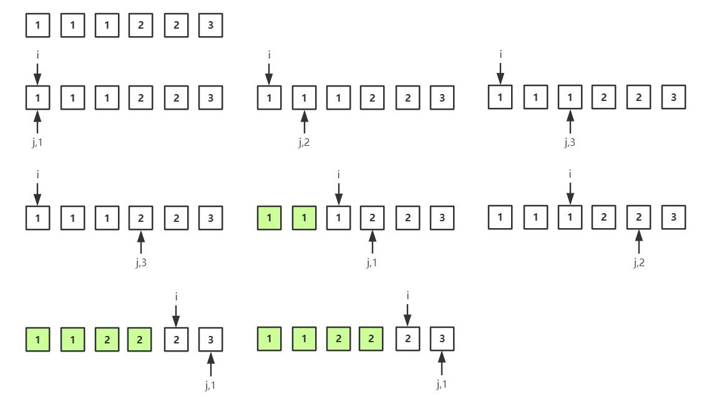

# 80 remove-duplicates-from-sorted-array-ii

`中等` `双指针`

https://leetcode-cn.com/problems/remove-duplicates-from-sorted-array-ii/


## 题目描述

给定一个排序数组，你需要在原地删除重复出现的元素，使得每个元素最多出现两次，返回移除后数组的新长度。

不要使用额外的数组空间，你必须在原地修改输入数组并在使用 O(1) 额外空间的条件下完成。


## 思路分析

我的方法挺菜的，但思路是对的，设置快慢指针。如下图所示：




## 代码

Python代码

```python
class Solution(object):
    def removeDuplicates(self, nums):
        """
        :type nums: List[int]
        :rtype: int
        """
        if len(nums) <= 2:
            return len(nums)

        i = 0
        cur = nums[0]
        counter = 0
        for j in range(len(nums)):
            if nums[j] == cur:
                counter += 1
            else:
                for k in range(min(counter, 2)):
                    nums[i] = cur
                    i += 1
                cur = nums[j]
                counter = 1
        for k in range(min(counter, 2)):
            nums[i] = cur
            i += 1
        return i
```

