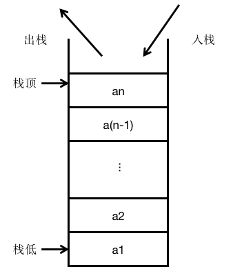
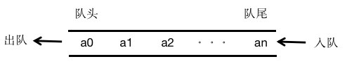
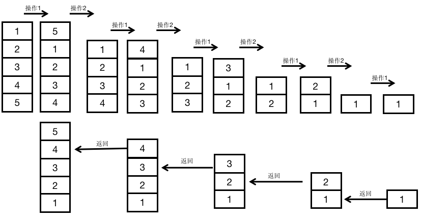
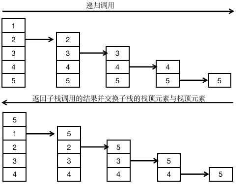

## 1.堆栈定义

​		栈与队列是两种先行数据结构，都是在一个特定范围的春初单元中存储数据；与线性表相比，它们的插入和删除操作收到更多的约束和限定，故又称为限定性的的线性表结构。不同的是，栈就像是一个很窄的桶，先存进去的数据只能最后取出来，是LIFO（Last In First Out，后进先出），它将进出的顺序逆序，即先进后出，后进先出。栈的结构如下所示。



​		队列像日常排队买东西的人的“队列”，先排队的人先买，后排队的人后买，是FIFO（First in First Out，先进先出）的，它保持进出顺序一致，即先进先出，后进后出。队列的结构入下图所示。 



​		需要注意的是，有时数据结构中还有可能出现按照大小排队或按照一定条件排队的数据队列。这时的队列属于特殊队列，就不一定按照“先进先出”的原则读取数据了。

## 2.栈和队列的基本实现

### 2.1 栈的实现

栈的基本操作：

stack.push()      无返回值

stack.pop()        返回出栈元素

stack.peak()      返回栈顶元素

stack.size()	    返回当前栈内元素个数     

stack.isEmpty() 返回 True/False

#### 2.1.1 线性表实现堆栈

```python
class Stack():
	def __init__(self):
		self.items=[]
	def isEmpty(self):
		return self.items==[]
	def push(self,item):
		self.items.append(item)
	def pop(self):
		if(not self.isEmpty()):
			return self.items.pop()
		return "null"
	def peek(self):
		if(not self.isEmpty()):
			return self.items[-1]
	def size(self):
		return len(self.items)

if __name__ == "__main__":
	stack = Stack()
	stack.push("hello")
	print(stack.pop())
	print(stack.peek())
	print(stack.pop())
	print(stack.size())
```

#### 2.1.2 链表实现堆栈

```python
class Node:
    def __init__(self,val):
        self.next = None
        self.val = val
class MyStack:
    def __init__(self,maxLength):
        self.head = None
        self.nowSize = 0
        self.length = maxLength
    def isEmpty(self):
        return self.head==None
    def isFull(self):
        return self.nowSize == self.length
    def push(self,val):
        if(not self.isFull()):
            p = Node(val)
            if(self.nowSize == 0):
                self.head = p 
                self.tail = p 
            else:
                h = self.head
                while(h.next):
                    h = h.next
                h.next = p
            self.nowSize += 1
            return True
        return False
    def pop(self):
        if(not self.isEmpty()):
            if(not self.head.next):
                self.head = None
            else:
                h = self.head
                pre = h
                while(h.next):
                    pre = h
                    h = h.next
                pre.next = None
                self.nowSize -=1
            return True
        return False
    def peek(self):
        if(not self.isEmpty()):
            h = self.head
            while(h.next):
                h = h.next
            return h.val
        return False
stack1 = MyStack(10)
print(stack1.push(1))
print(stack1.peek())
print(stack1.pop())
```


### 2.2 队列的实现

#### 2.2.1 线性表实现队列

```java
import java.util.ArrayList;

 class MyQueue <T>{
	private  ArrayList<T> arr = new ArrayList<T>();
	private int front;
	private int rear;
	public MyQueue() {
		front = 0;
		rear = 0;
	}
	//判断队列是否是空
	public boolean isEmpty() {
		return front == rear;
	}
	//返回队列的大小
	public int size() {
		return rear-front;
	}
	//返回队首元素
	public T getFont() {
		if(isEmpty()) {
			return null;
		}
		return arr.get(front);
	}
	//返回队首元素
	public T getRear() {
		if(isEmpty()) {
			return null;
		}
		return arr.get(rear-1);
	}
	//删除队头元素
	public void deQueue() {
		if(rear > front) {
			front++;
		}else {
			System.out.println("队列已经为空");
		}
	}
	
	//把新元素加入队尾
	public void enQueue(T item) {
		arr.add(item);
		rear++;
	}
}
public class Test{
	public static void main(String[] args) {
		MyQueue<Integer>queue = new MyQueue<Integer>();
		queue.enQueue(1);
		queue.enQueue(2);
		queue.enQueue(3);
		System.out.println("队首元素为："+queue.getFont());
		System.out.println("队尾元素为："+queue.getRear());
		System.out.println("队列大小为："+queue.size());
	}
}
```


#### 2.2.2 链表实现队列

```java
class LNode<T>{
	T data;
	LNode<T> next;
}

class MyQueue<T>{
	private LNode<T> pHead;
	private LNode<T> pEnd;
	
	//分配头节点
	public MyQueue() {
		pEnd = pHead = null;
	}
	//判断队列是否为空，如果为空返回true，否则返回false
	boolean empty() {
		if(pHead == null) {
			return true;
		}
		return false;
	}
	//获取栈中元素的个数
	int size() {
		int size = 0;
		LNode<T> p = pHead;
		while (p!= null) {
			p = p.next;
			size++;
		}
		return size;
	}
	//入队列：把元素e加到队列尾
	void enQueue(T e) {
		LNode<T> p = new LNode<T>();
		p.data = e;
		p.next = null;
		if(pHead == null)
			pHead = pEnd = p;
		else {
			pEnd.next = p;
			pEnd = p;
		}	
	}
	//出队伍，删除队列首元素
	void deQueue() {
		if(pHead == null)
			return ;
		pHead = pHead.next;
		if(pHead == null)
			pEnd = null;
	}
	//取得队首元素
	T getFont() {
		if(pHead == null) {
			System.out.println("获得队首元素失败，队列已经为空");
			return null;
		}
		return pHead.data;
	}
	//取得队尾元素
	T getRear() {
		if(pHead == null) {
			System.out.println("获得队尾元素失败，队列已经为空");
			return null;
		}
		return pEnd.data;
	}
}
public class Test {
	public static void main(String[] args) {
		MyQueue<Integer> queue = new MyQueue<Integer>();
		queue.enQueue(1);
		queue.enQueue(2);
		queue.enQueue(3);
		System.out.println("队首元素为："+queue.getFont());
		System.out.println("队尾元素为："+queue.getRear());
		System.out.println("队列大小为: "+queue.size());
	}
}
```


## 3. 相关习题

1. 有效的括号https://leetcode-cn.com/problems/valid-parentheses

   ```
   给定一个只包括 '('，')'，'{'，'}'，'['，']' 的字符串，判断字符串是否有效。有效字符串需满足：
   左括号必须用相同类型的右括号闭合。
   左括号必须以正确的顺序闭合。
   注意空字符串可被认为是有效字符串。
   示例 1:
   输入: "()[]{}"
   输出: true
   示例 2:
   输入: "(]"
   输出: false
   ```

   ```python
   class Solution:
       def isValid(self, s: str) -> bool:
           stack = []
           for i in range(len(s)):
               if(s[i] == '(' or s[i]=='[' or s[i]=='{'):
                   stack.append(s[i])
               else:
                   top = stack[-1] if stack else " "
                   if((s[i]==')' and top =='(') or (s[i]==']' and top =='[') or (s[i]=='}' and top =='{')):
                       stack.pop()
                   else:
                       return False
   
           return stack==[]
   ```

   

2. 计算逆向波兰表达式 https://leetcode-cn.com/problems/evaluate-reverse-polish-notation

   ```
   根据逆波兰表示法，求表达式的值。
   有效的运算符包括 +, -, *, / 。每个运算对象可以是整数，也可以是另一个逆波兰表达式。
   说明：
   整数除法只保留整数部分。
   给定逆波兰表达式总是有效的。换句话说，表达式总会得出有效数值且不存在除数为 0 的情况。
   示例 1：
   输入: ["2", "1", "+", "3", "*"]
   输出: 9
   解释: ((2 + 1) * 3) = 9
   示例 2：
   输入: ["4", "13", "5", "/", "+"]
   输出: 6
   解释: (4 + (13 / 5)) = 6
   示例 3：
   输入: ["10", "6", "9", "3", "+", "-11", "*", "/", "*", "17", "+", "5", "+"]
   输出: 22
   ```

   ```python
    def evalRPN(self, tokens: List[str]) -> int:
           if not tokens:
               return 0
           stack = []
           for token in tokens:
               if token == '+':
                   second = stack.pop()
                   first = stack.pop()
                   stack.append(first+second)
               elif token == '-':
                   second = stack.pop()
                   first = stack.pop()
                   stack.append(first-second)
               elif token == '*':
                   second = stack.pop()
                   first = stack.pop()
                   stack.append(first*second)
               elif token == '/':
                   second = stack.pop()
                   first = stack.pop()
                   stack.append(int(first/second))
               else:
                   stack.append(int(token))
           return stack[0]
   ```

3. 最小栈 https://leetcode-cn.com/problems/min-stack

   ```
   设计一个支持 push，pop，top 操作，并能在常数时间内检索到最小元素的栈。
   push(x) -- 将元素 x 推入栈中。
   pop() -- 删除栈顶的元素。
   top() -- 获取栈顶元素。
   getMin() -- O(1)时间复杂度，检索栈中的最小元素。
   ```

   ```python
   class MinStack:
   
       def __init__(self):
           """
           initialize your data structure here.
           """
           self.minStack = []
           self.stack = []
       def push(self, x: int) -> None:
           if(not self.stack):
               self.stack.append(x)
               self.minStack.append(x)
           else:
               self.stack.append(x)
               if(x < self.minStack[-1]):
                   self.minStack.append(x)
               else:
                   self.minStack.append(self.minStack[-1])
       def pop(self) -> None:
           if(self.stack):
               self.stack.pop()
               self.minStack.pop()
   
       def top(self) -> int:
           if(not self.stack):
               return 0
           return self.stack[-1]
           
       def getMin(self) -> int:
           return self.minStack[-1]
   ```

   

4. 如何反转栈的所有元素【ALBB面试题】

   **题目描述**

   ```
   反转栈的所有元素，如输入栈「1，2，3，4，5」。其中，1处在栈顶，反转之后栈为「5，4，3，2，1」，5处在栈顶。
   ```

   **分析与解答**

   ```
   最容易想到的办法是，申请一个额外的队列，先把栈中的元素依次放到队列里，然后把队列里的元素按照出队列顺序入栈，这样就可以实现栈的反转，这种方法的缺点是需要射你去那个外的空间春初队列，因此，空间复杂度较高。
   
   还有一种空间复杂度较低的递归的方法。递归程序有两个关键因素需要注意：递归定义和递归终止条件。递归定义：将当前栈的最底元素移到栈顶，其他元素顺次下移一位，然后对不包含栈顶元素的子栈进行同样的操作。终止条件：递归下去，直到栈为空。递归调用的过程如下图所示。
   
   ```

   

   ```
   在上图中，对于栈「1，2，3，4，5」，进行反转的操作：首先把栈底元素移动到栈顶，得到栈「5，1，2，3，4」，然后对不包含栈顶元素的子栈进行递归调用（对子栈进行翻转），子栈「1，2，3，4」翻转的结果为「4，3，2，1」，因此，最终得到翻转后的栈为「5，4，3，2，1」。
   
   此外，由于栈的后进先出的特点，使得只能取栈顶元素，因此，要把栈底元素移到栈顶也需要递归调用才能完成。主要思路：把不包含该栈顶元素的子栈的栈底的元素移动到子栈的栈顶，然后把栈顶的元素与子栈栈顶的元素（其实就是与栈顶相邻的元素）进行交换。
   ```

   

   为了更容易理解递归调用，可认为在进行递归调用时，子栈已经把栈底元素移动到了栈顶。在上图中，为了把栈「1，2，3，4，5」的栈底元素5移动到栈顶，首先对子栈「2，3，4，5」进行递归调用，调用的结果为「5，2，3，4」，然后在对子栈元素5，与栈顶元素1进行交换得到「5，1，2，3，4」，实现了吧栈底元素移动到了栈顶。

   ```java
   public class Test {
   	/*
   	 * 方法功能：把栈底元素移动到栈顶
   	 * 参数：s栈的引用
   	 * */
   	private static void move_bottom_to_top(Stack<Integer>s) {
   		if(s.empty())
   			return ;
   		int top1 = s.peek();
   		s.pop();
   		if(!s.empty()) 
   		{
   			//递归处理不包含栈顶元素的子栈
   			move_bottom_to_top(s);
   			int top2 = s.peek();
   			s.pop();
   			s.push(top1);
   			s.push(top2);
   		}
   		else {
   			s.push(top1);
   		}
   	}
   	
   	public static void reverse_stack(Stack<Integer>s) {
   		if(s.empty())
   			return ;
   		//把栈底元素移动到栈顶
   		move_bottom_to_top(s);
   		int top  = s.peek();
   		s.pop();
   		//递归处理子栈
   		reverse_stack(s);
   		s.push(top);
   	}
   	public static void main(String[] args) {
   		// TODO Auto-generated method stub
   		Stack<Integer>s = new Stack<>();
   		s.push(5);
   		s.push(4);
   		s.push(3);
   		s.push(2);
   		s.push(1);
   		reverse_stack(s);
   		System.out.println("翻转后出栈的顺序为：");
   		while(!s.empty())
   		{
   			System.out.println(s.peek()+" ");
   			s.pop();
   		}
   	}
   }
   ```

   

5. 如何给栈排序

   主要思路：首先对不包含栈顶元素的子栈进行排序，如果栈顶元素大于子栈的栈顶元素，则交换这两个元素。因此，在上述方法中，只需要在交换栈顶元素与子栈元素事增加一个条件判断即可实现栈的排序。时间复杂度o(N^2)

   ```java
   //java
   public class sort {
   	/*
   	 * 方法功能：把栈底元素移动到栈顶
   	 * 参数：s栈的引用
   	 * */
   	private static void move_bottom_to_top(Stack<Integer>s) {
   		if(s.empty())
   			return ;
   		int top1 = s.peek();
   		s.pop();
   		if(!s.empty()) 
   		{
   			//递归处理不包含栈顶元素的子栈
   			move_bottom_to_top(s);
   			int top2 = s.peek();
   			if(top1 > top2)
   			{
   				s.pop();
   				s.push(top1);
   				s.push(top2);
   				return ;
   			}
   		}
   		s.push(top1);
   	}
   	
   	public static void sort_stack(Stack<Integer>s) {
   		if(s.empty())
   			return ;
   		//把栈底元素移动到栈顶
   		move_bottom_to_top(s);
   		int top  = s.peek();
   		s.pop();
   		//递归处理子栈
   		sort_stack(s);
   		s.push(top);
   	}
   	public static void main(String[] args) {
   		Stack<Integer>s = new Stack<>();
   		s.push(3);
   		s.push(5);
   		s.push(2);
   		s.push(1);
   		s.push(4);
   		sort_stack(s);
   		System.out.println("排序后出栈的顺序为：");
   		while(!s.empty())
   		{
   			System.out.println(s.peek()+" ");
   			s.pop();
   		}
   	}
   }
   ```

   ```python
   #python
   class StackSorter:
   	def sortByRecursion(self,stack):
   		if(len(stack)==0):
   			return stack
   		#先把弹出的元素寄存在调用的堆栈上
   		v = stack.pop()
   		#递归地对余下的元素进行排序
   		stack = self.sortByRecursion(stack)
   		#递归地把元素按顺序插入堆栈
   		stack=self.insert(stack,v)
   		return stack
   
   	def insert(self,stack,val):
   		if(len(stack)==0 or val <= stack[len(stack)-1]):
   			#如果插入的值比栈顶元素小，那么只将该元素压入栈顶
   			stack.append(val)
   			return stack
   		t = stack.pop()
   		self.insert(stack,val)
   		stack.append(t)
   		return stack
   stack = [3,2,5,6,1,4]
   st = StackSorter()
   s = st.sortByRecursion(stack)
   print(s)
   ```

   

6. 如何根据入栈序列判断可能的出栈序列【出自TX面试题】

   **题目描述**

   ```
   输入两个整数序列，其中一个序列表示栈的push（入）顺序，判断另一个序列有没有可能是对应的pop（出）顺序。
   ```

   **分析与解答**

   ```
   加入输出的push序列是1、2、3、4、5，那么3、2、5、4、1就有可能是一个pop序列，但5、3、4、1、2就不可能是它的一个pop序列。
   
   主要思路：
   1）把push序列依次入栈，直到栈顶元素等于pop序列的第一个元素，然后栈顶元素出栈，pop序列移动到第二个元素
   2）如果栈顶继续等于pop序列现在的元素，则继续出栈并pop后移；否则对push序列继续入栈
   3）如果push序列全部已经入栈，但是pop序列未全部遍历，而且栈顶元素不等于当前pop元素，那么这个序列不是一个可能的出栈序列。如果栈为空，而且pop序列也全部被遍历过，则说明这是一个可能的pop序列。
   ```

   ```java
   public class Test {
   
   	public static boolean isPopSerial(String push, String pop) {
   		if(push == null || pop == null)
   			return false;
   		int pushLen = push.length();
   		int popLen = pop.length();
   		if(pushLen != popLen)
   			return false;
   		int pushIndex = 0;
   		int popIndex = 0;
   		Stack<Character> stack = new Stack<>();
   		while(pushIndex<pushLen)
   		{
   			//把push序列依次入栈，直到栈顶元素等于pop序列的第一个元素
   			stack.push(push.charAt(pushIndex));
   			pushIndex++;
   			while(!stack.empty() && stack.peek()==pop.charAt(popIndex))
   			{
   				stack.pop();
   				popIndex++;
   			}
   		}
   		return stack.empty()&& popIndex==popLen;
   	}
   	public static void main(String[] args) {
   		String push = "12345";
   		String pop = "53412";
   		if(isPopSerial(push,pop))
   			System.out.println(pop+"是"+push+"的一个pop序列");
   		else 
   			System.out.println(pop+"不是"+push+"的一个pop序列");
   	}
   }
   ```

   

7. 利用两个栈模拟队列操作【JD面试题】

   **分析与解答**

   ```
   要求用两个栈来模拟队列，假设使用栈A与栈B模拟队列Q，A为插入栈，B为弹出栈，以实现队列Q
   再假设栈A和栈B都为空，可以认为栈A提供入队列的功能，栈B提供出队列的功能。
   要入队列，入栈A即可，而出队列则需要考虑两种情况：
   1）如果栈B不为空，则直接弹出栈B的数据
   2）如果栈B为空，则依次弹出栈A的数据，放入栈B中，再弹出栈B的数据。
   ```

   ```java
   class MyStack<T>
   {
   	private Stack<T>A = new Stack<>();
   	private Stack<T>B = new Stack<>();
   	public void push(T data)
   	{
   		A.push(data);
   	}
   	public T pop()
   	{
   		if(B.empty()) {
   			while(!A.empty())
   			{
   				B.push(A.peek());
   				A.pop();
   			}
   		}
   		T first = B.peek();
   		B.pop();
   		return first;
   	}
   }
   public class Test {
   	public static void main(String[] args) {
   		MyStack<Integer>stack = new MyStack<Integer>();
   		stack.push(1);
   		stack.push(2);
   		System.out.println("队首元素为:"+stack.pop());
   		System.out.println("队首元素为:"+stack.pop());
   	}
   }
   ```

   

8. 堆栈解决汉诺塔问题

9. 简化路径 https://leetcode-cn.com/problems/simplify-path

   **题目描述**

   ```
   以 Unix 风格给出一个文件的绝对路径，你需要简化它。或者换句话说，将其转换为规范路径。
   
   在 Unix 风格的文件系统中，一个点（.）表示当前目录本身；此外，两个点 （..） 表示将目录切换到上一级（指向父目录）；两者都可以是复杂相对路径的组成部分。更多信息请参阅：Linux / Unix中的绝对路径 vs 相对路径
   
   请注意，返回的规范路径必须始终以斜杠 / 开头，并且两个目录名之间必须只有一个斜杠 /。最后一个目录名（如果存在）不能以 / 结尾。此外，规范路径必须是表示绝对路径的最短字符串。
   示例 1：
   输入："/home/"
   输出："/home"
   示例 2：
   输入："/../"
   输出："/"
   示例 3：
   输入："/home//foo/"
   输出："/home/foo"
   示例 4：
   输入："/a/./b/../../c/"
   输出："/c"
   示例 5：
   输入："/a/../../b/../c//.//"
   输出："/c"
   示例 6：
   输入："/a//b////c/d//././/.."
   输出："/a/b/c"
   ```

   **分析与解答**

   ```
   因为涉及到当前目录和上层目录，所以很容易想到用栈来实现。首先路径path用split('/')将字符串分割为数组，如果path[i]=‘..’,栈不为空则出栈,反之，continue；如果path[i]=''or path[i]=='.',continue；若path[i]!= '..'or'.'or'',则入栈。将栈内元素（list）转化成以‘/’相连的字符串即为所求。时间复杂度o(n)
   ```

   ```python
   class Solution:
       def simplifyPath(self, path: str) -> str:
           if len(path) == 0:
               return "/"
           else:
               arr = path.split('/')
               stack = []
               for object in arr:
                   if object == '..':
                       if len(stack) != 0:
                           stack.pop()
                   elif object != '' and object !='.':
                       stack.append(object)
               if len(stack) == 0:
                   return '/'
               else:
                   return '/'+'/'.join(stack)
   
   ```

   

10. 二叉树的先序遍历，中序遍历和后序遍历

   https://leetcode-cn.com/problems/binary-tree-preorder-traversal/

   **题目描述**

   ```
   给定一个二叉树，返回它的先序遍历。
   
   示例:
   输入: [1,null,2,3]
      1
       \
        2
       /
      3
   
   输出: [1,3,2]
   ```

   **分析与解答**

   ```
   二叉树的遍历都可以借助栈结构使用DFS算法完成。
   首先是最简单的先序遍历，父>左>右。每次入栈前先将父节点加入结果列表，然后左节点入栈。当左子树遍历完后，再遍历右子树。
   ```

   ```python
   #先序
   class Solution:
       def preorderTraversal(self, root: TreeNode) -> List[int]:
           res = []  #结果列表
           stack = []  #辅助栈
           cur = root  #当前节点
           while stack or cur:
               while cur:  #遍历到最后一层
                   res.append(cur.val)  
                   stack.append(cur)
                   cur = cur.left
               top = stack.pop()  #此时该节点的左子树已经全部遍历完
               cur = top.right  #对右子树遍历
           return res
   ```

   ```python
   #中序
   class Solution:
       def inorderTraversal(self, root: TreeNode) -> List[int]:
           res = []
           stack = []
           cur = root
           while stack or cur:
               while cur:
                   stack.append(cur)
                   cur = cur.left
               top = stack.pop() #此时左子树遍历完成
               res.append(top.val)  #将父节点加入列表
               cur = top.right #遍历右子树
           return res
   ```

   ```python
   #后序
   class Solution:
       def postorderTraversal(self, root: TreeNode) -> List[int]:
           res = []
           stack = []
           cur = root
           while stack or cur:
               while cur:
                   res.append(cur.val)
                   stack.append(cur)
                   cur = cur.right  #先将右节点压栈
               top = stack.pop()  #此时该节点的右子树已经全部遍历完
               cur = top.left  #对左子树遍历
           return res[::-1]  #结果翻转
   ```

11. 用队列实现栈https://leetcode-cn.com/problems/implement-stack-using-queues/

    **题目描述**

    ```
    使用队列实现栈的下列操作：
    
    push(x) -- 元素 x 入栈
    pop() -- 移除栈顶元素
    top() -- 获取栈顶元素
    empty() -- 返回栈是否为空
    ```

    **分析与解答**

    ```
    用两个单项队列实现栈。队列是先进先出，栈是后进先出。一个队列用来存数据，另一个队列作为辅助队列。对于元素X，若A队列为空，则直接入队列；反之，则先将队列A中的元素出队列并进入队列B，将X入队列A，再将队列B中的元素出队列并入队列B。队列B作为辅助队列，作用是辅助原队列将数据逆序。出栈则直接出栈。判断栈是否为空，则直接判断队列A是否为空即可。得到栈顶元素，即get()队列A的队头，并用push()操作栈顶元素入栈。
    ```

    ```python
    from queue import Queue
    class MyStack:
    
        def __init__(self):
            """
            Initialize your data structure here.
            """
            self.queA = Queue()
            self.queB = Queue()
        def push(self, x: int) -> None:
            if(self.queA.empty()):
                self.queA.put(x)
            else:
                while(not self.queA.empty()):
                    val = self.queA.get()
                    self.queB.put(val)
                self.queA.put(x)
                while(not self.queB.empty()):
                    val = self.queB.get()
                    self.queA.put(val)
        def pop(self) -> int:
            return self.queA.get()
        def top(self) -> int:
            val = self.queA.get()
            self.push(val)
            return val
        def empty(self) -> bool:
            return self.queA.empty()
    # Your MyStack object will be instantiated and called as such:
    # obj = MyStack()
    # obj.push(x)
    # param_2 = obj.pop()
    # param_3 = obj.top()
    # param_4 = obj.empty()
    ```

    

12. 最近的请求次数https://leetcode-cn.com/problems/number-of-recent-calls/submissions/

    **题目描述**

    ```
    写一个 RecentCounter 类来计算最近的请求。
    它只有一个方法：ping(int t)，其中 t 代表以毫秒为单位的某个时间。
    返回从 3000 毫秒前到现在的 ping 数。
    任何处于 [t - 3000, t] 时间范围之内的 ping 都将会被计算在内，包括当前（指 t 时刻）的 ping。
    保证每次对 ping 的调用都使用比之前更大的 t 值。
    
    输入：inputs = ["RecentCounter","ping","ping","ping","ping"], inputs = [[],[1],[100],[3001],[3002]]
    输出：[null,1,2,3,3]
    ```

    **分析与解答**

    ```python
    '''
    这是一个简单的队列应用题
    （1）若当前将要入队列的元素>队首元素+3000，则出队列
    （2）直到将要入队列元素<=队首元素+3000，当前元素入队列
    （3）返回队列的长度
    '''
    from collections import deque
    class RecentCounter:  
        def __init__(self):
            self.q = deque()
        def ping(self, t: int) -> int:
            while(self.q and self.q[0]+3000<t):
                self.q.popleft()
            self.q.append(t)
            return len(self.q)
    ```

    